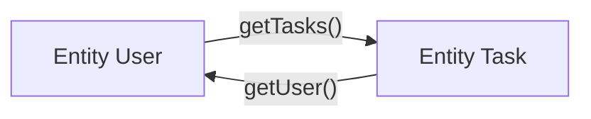

# Pilot Project Back - Nhật ký lỗi & Danh sách bài tập (Exercises Log)

Tài liệu này tổng hợp:
1. [**Phần I: Nhật ký lỗi và Cách khắc phục (Issue Log & Solutions)**](#phần-i-nhật-ký-lỗi-và-cách-khắc-phục-issue-log--solutions)
2. [**Phần II: Danh sách các bài tập đã hoàn thành (Completed Exercises)**](#phần-ii-danh-sách-các-bài-tập-đã-hoàn-thành-completed-exercises)
   - [Exercise 1: Spring Data JPA & QueryDSL Repositories](#exercise-1-spring-data-jpa--querydsl-repositories)
   - [Exercise 2: Quản lý giao dịch với Spring (Transaction Management with Spring)](#exercise-2-quản-lý-giao-dịch-với-spring-transaction-management-with-spring)
   - [Exercise 3: Khắc phục lỗi LazyInitializationException (Task 13 - Roadmap 5.1)](#exercise-3-khắc-phục-lỗi-lazyinitializationexception-task-13---roadmap-51)
   - [Exercise 4: Loại bỏ vấn đề "SELECT N + 1" (Task 14 - Roadmap 5.1)](#exercise-4-loại-bỏ-vấn-đề-select-n--1-task-14---roadmap-51)
   - [Exercise 5: Tối ưu hóa truy vấn hàng loạt - Loại bỏ N câu truy vấn trong vòng lặp (Task 15 - Roadmap 5.1)](#exercise-5-tối-ưu-hóa-truy-vấn-hàng-loạt---loại-bỏ-n-câu-truy-vấn-trong-vòng-lặp-task-15---roadmap-51)
   - [Exercise 6: Khắc phục vi phạm mẫu thiết kế Single Unit of Work - Cạm bẫy Checked Exception trong Transaction (Task 16 - Roadmap 5.1)](#exercise-6-khắc-phục-vi-phạm-mẫu-thiết-kế-single-unit-of-work---cạm-bẫy-checked-exception-trong-transaction-task-16---roadmap-51)
   - [Exercise 7: Đảm bảo lưu dữ liệu Audit Log khi Transaction chính bị Rollback (Task 17 - Roadmap 5.1)](#exercise-7-đảm-bảo-lưu-dữ-liệu-audit-log-khi-transaction-chính-bị-rollback-task-17---roadmap-51)
   - [Exercise 8: Đảm bảo lưu quan hệ khi thêm Tasks cho User - Cạm bẫy Owning Side vs Inverse Side (Task 18 - Roadmap 5.1)](#exercise-8-đảm-bảo-lưu-quan-hệ-khi-thêm-tasks-cho-user---cạm-bẫy-owning-side-vs-inverse-side-task-18---roadmap-51)
   - [Exercise 9: Khắc phục lỗi lặp vô tận khi chuyển đổi Entity sang JSON - Recursive Entity in Request Response (Task 19 - Roadmap 5.1)](#exercise-9-khắc-phục-lỗi-lặp-vô-tận-khi-chuyển-đổi-entity-sang-json---recursive-entity-in-request-response-task-19---roadmap-51)


---

# PHẦN I: Nhật ký lỗi và Cách khắc phục (Issue Log & Solutions)

Ghi lại các lỗi gặp phải trong quá trình thiết lập và phát triển ban đầu của dự án kèm theo nguyên nhân và cách khắc phục chi tiết.

---

## 1. Lỗi không tìm thấy class `QProject` (QueryDSL Compilation Error)

### Mô tả lỗi
Khi build dự án hoặc mở các file có sử dụng QueryDSL (như `ProjectRepositoryTest`, `TaskRepositoryCustomImpl`), trình biên dịch báo lỗi:
```text
java: cannot find symbol
  symbol:   class QProject
  location: package vn.elca.training.model.entity
```

### Nguyên nhân
- `QProject`, `QTask`, `QUser`... là các **Q-classes (Metamodel)** được thư viện **QueryDSL** tự động sinh ra từ các JPA Entities (như `Project`, `Task`, `User`) thông qua annotation processor `apt-maven-plugin`.
- Khi mới clone dự án về hoặc sau khi chạy `mvn clean`, thư mục mã nguồn tự sinh (`target/generated-sources`) chưa được tạo ra, hoặc IDE chưa nhận diện thư mục này là **Generated Sources Root**.

### Cách khắc phục
1. **Chạy Maven Compile**:
   Chạy lệnh sau tại thư mục gốc của dự án để sinh lại toàn bộ Q-classes:
   ```bash
   mvn clean compile
   ```
2. **Cấu hình trên IDE (IntelliJ IDEA)**:
   - Mở tab **Maven** $\rightarrow$ `Lifecycle` $\rightarrow$ double-click vào **`compile`**.
   - Chuột phải vào thư mục `target/generated-sources` trong Project view $\rightarrow$ chọn **Mark Directory as** $\rightarrow$ **Generated Sources Root**.
   - Bật Annotation Processors: Vào **Settings/Preferences** $\rightarrow$ **Build, Execution, Deployment** $\rightarrow$ **Compiler** $\rightarrow$ **Annotation Processors** $\rightarrow$ tích chọn **Enable annotation processing**.

---

## 2. Lỗi cấu hình Custom Repository với class `RenameThisClass` (Spring Data JPA Wiring Error)

### Mô tả lỗi
- Class `vn.elca.training.repository.custom.RenameThisClass` thực thi interface `TaskRepositoryCustom`.
- Interface chính `TaskRepository` kế thừa cả `JpaRepository` và `TaskRepositoryCustom`.
- Khi ứng dụng Spring Boot khởi động, Spring Data JPA không thể liên kết (wire) phần code custom này vào `TaskRepository`, dẫn đến lỗi `BeanCreationException` / `PropertyReferenceException` khi cố phân tích các hàm custom thành derived queries.

### Nguyên nhân
- **Quy ước đặt tên (Naming Convention) của Spring Data JPA**: Khi một Repository interface kế thừa một Custom interface (ví dụ `TaskRepository` kế thừa `TaskRepositoryCustom`), Spring Data JPA sẽ tự động tìm kiếm class thực thi dựa trên quy ước đặt tên:
  - `<CustomInterfaceName>Impl` $\rightarrow$ `TaskRepositoryCustomImpl`
  - Hoặc `<RepositoryName>Impl` $\rightarrow$ `TaskRepositoryImpl`
- Do class đang được đặt tên tùy ý là `RenameThisClass`, Spring Data JPA không nhận ra đây là implementation của `TaskRepositoryCustom`, đồng thời class cũng không có annotation `@Component`/`@Repository` để đăng ký làm bean độc lập.

### Cách khắc phục
1. **Đổi tên class và file**:
   - Đổi tên file từ `RenameThisClass.java` thành `TaskRepositoryCustomImpl.java` (hoặc `TaskRepositoryImpl.java`).
   - Đổi tên khai báo class trong code:
     ```java
     package vn.elca.training.repository.custom;

     // Đổi từ public class RenameThisClass sang:
     public class TaskRepositoryCustomImpl implements TaskRepositoryCustom {
         // ... nội dung giữ nguyên
     }
     ```
2. Sau khi đổi tên đúng chuẩn, Spring Data JPA sẽ tự động nhận diện và ghép các method `findProjectsByTaskName` và `listRecentTasks` vào `TaskRepository` mà không cần cấu hình gì thêm.

---

## 3. Lỗi `NullPointerException` tại `ProjectServiceImpl.count()` (Missing Dependency Injection)

### Mô tả lỗi
Khi truy cập endpoint `/main`, hệ thống gặp lỗi ngoại lệ:
```text
java.lang.NullPointerException: null
	at vn.elca.training.service.impl.ProjectServiceImpl.count(ProjectServiceImpl.java:28)
	at vn.elca.training.web.MainController.main(MainController.java:32)
```

### Nguyên nhân
- Trong class `ProjectServiceImpl`, thuộc tính `projectRepository` chỉ được khai báo dạng `private ProjectRepository projectRepository;` nhưng **chưa được tiêm (inject) Bean vào** (thiếu `@Autowired` hoặc Constructor Injection).
- Khi gọi phương thức `projectService.count()`, biến `this.projectRepository` đang mang giá trị `null`, dẫn đến việc gọi `null.count()` gây ra `NullPointerException`.
- Tương tự trong `MainController`, thuộc tính `private String title;` cũng bị thiếu annotation `@Value("${application.title}")` để đọc giá trị từ file `messages.properties`.

### Cách khắc phục
1. **Trong `ProjectServiceImpl.java`**: Thêm `@Autowired` (Field injection hoặc Constructor injection):
   ```java
   @Service
   @Profile("!dummy | dev")
   public class ProjectServiceImpl implements ProjectService {

       @Autowired
       private ProjectRepository projectRepository;

       // ...
   }
   ```
2. **Trong `MainController.java`**: Thêm `@Value("${application.title}")` cho biến `title`:
   ```java
   @Value("${application.title}")
   private String title;
   ```

---

# PHẦN II: Danh sách các bài tập đã hoàn thành (Completed Exercises)

Các bài tập được thực hiện theo lộ trình đào tạo (`HIBERNATE-17.doc`) nhằm nắm vững Spring Data JPA, QueryDSL, Hibernate Core và Transaction Management.

---

## Exercise 1: Spring Data JPA & QueryDSL Repositories

### 1. Mục tiêu bài tập
* Thiết kế và ánh xạ (Mapping) quan hệ giữa các thực thể: `Group`, `Project`, `User`.
* Xây dựng Repository mở rộng Spring Data JPA kết hợp QueryDSL.
* Viết bộ kiểm thử tự động (Integration Test) kiểm tra tính toàn vẹn dữ liệu và các câu lệnh truy vấn phức tạp.

### 2. Các thành phần đã triển khai
1. **Thực thể (Entities)**:
   * [`Group.java`](file:///C:/Users/nnnq/01_Trainee/newcomers-java-master@d35fff52243/pilot-project-back/src/main/java/vn/elca/training/model/entity/Group.java):
     * Cấu hình `@Table(name = "PROJECT_GROUP")` (tránh xung đột từ khóa `GROUP` dành riêng của SQL/H2).
     * Khóa chính `@Id @GeneratedValue(strategy = GenerationType.IDENTITY)`.
     * Ánh xạ quan hệ 1-1 với trưởng nhóm: `@OneToOne @JoinColumn(name = "GROUP_LEADER_ID") private User groupLeader`.
     * Ánh xạ quan hệ 1-N với dự án: `@OneToMany(mappedBy = "group") private List<Project> projects`.
   * [`Project.java`](file:///C:/Users/nnnq/01_Trainee/newcomers-java-master@d35fff52243/pilot-project-back/src/main/java/vn/elca/training/model/entity/Project.java):
     * Ánh xạ quan hệ N-1 với nhóm: `@ManyToOne @JoinColumn(name = "GROUP_ID") private Group group`.
     * Ánh xạ quan hệ N-N với thành viên: `@ManyToMany` liên kết với `User` qua bảng trung gian `PROJECT_USER`.
   * [`User.java`](file:///C:/Users/nnnq/01_Trainee/newcomers-java-master@d35fff52243/pilot-project-back/src/main/java/vn/elca/training/model/entity/User.java): Bổ sung các constructor tiện ích phục vụ khởi tạo dữ liệu mẫu.

2. **Repository**:
   * [`GroupRepository.java`](file:///C:/Users/nnnq/01_Trainee/newcomers-java-master@d35fff52243/pilot-project-back/src/main/java/vn/elca/training/repository/GroupRepository.java): Kế thừa `JpaRepository<Group, Long>` và `QuerydslPredicateExecutor<Group>`.

3. **Kiểm thử tự động (Test Cases)**:
   * [`GroupRepositoryTest.java`](file:///C:/Users/nnnq/01_Trainee/newcomers-java-master@d35fff52243/pilot-project-back/src/test/java/vn/elca/training/repository/GroupRepositoryTest.java): Kiểm tra các thao tác CRUD cơ bản trên `Group`.
   * [`ProjectRepositoryTest.java`](file:///C:/Users/nnnq/01_Trainee/newcomers-java-master@d35fff52243/pilot-project-back/src/test/java/vn/elca/training/repository/ProjectRepositoryTest.java): Hoàn thiện đủ 5 bài test theo yêu cầu:
     * `testSaveOneProject`: Lưu một project độc lập và xác thực ID tự sinh.
     * `testSaveMultipleProjectsTree`: Lưu cấu trúc phân cấp gồm 2 Group (Group 1 - QMV, Group 2 - HNH) với đầy đủ các Projects và Members.
     * `testDeleteProject`: Kiểm tra xóa Project an toàn mà không làm mất User trong bảng `PROJECT_USER` (không cascade delete User).
     * `testSimpleQueryWithQueryDSL`: Truy vấn Project theo tên sử dụng QueryDSL Predicate (`QProject.project.name.eq(...)`).
     * `testComplexQueryWithQueryDSL`: Truy vấn nâng cao kết hợp JOIN đa bảng giữa `Project`, `Group`, `GroupLeader`, và `Customer`.

---

## Exercise 2: Quản lý giao dịch với Spring (`Transaction Management with Spring`)

### 1. Mục tiêu bài tập
* Xây dựng nghiệp vụ tạo dự án bảo trì (`createMaintenanceProject`) từ một dự án cũ.
* Áp dụng `@Transactional` để đảm bảo tính nguyên tử (Atomicity): Cập nhật trạng thái dự án cũ và tạo dự án mới phải cùng thành công hoặc cùng rollback khi xảy ra lỗi.

### 2. Các thành phần đã triển khai
1. **Thực thể (Entity)**:
   * [`Project.java`](file:///C:/Users/nnnq/01_Trainee/newcomers-java-master@d35fff52243/pilot-project-back/src/main/java/vn/elca/training/model/entity/Project.java):
     * Bổ sung thuộc tính `private boolean activated = true;`.
     * Cung cấp getter/setter: `isActivated()` và `setActivated(boolean)`.

2. **Nghiệp vụ Service**:
   * Khai báo trong [`ProjectService.java`](file:///C:/Users/nnnq/01_Trainee/newcomers-java-master@d35fff52243/pilot-project-back/src/main/java/vn/elca/training/service/ProjectService.java):
     ```java
     Project createMaintenanceProject(Long oldProjectId);
     ```
   * Cài đặt trong [`ProjectServiceImpl.java`](file:///C:/Users/nnnq/01_Trainee/newcomers-java-master@d35fff52243/pilot-project-back/src/main/java/vn/elca/training/service/impl/ProjectServiceImpl.java):
     * Đánh dấu `@Transactional(rollbackFor = Exception.class)`.
     * **Bước 1**: Tìm `oldProject`, nếu không tồn tại thì ném `ProjectNotFoundException`.
     * **Bước 2**: Đổi trạng thái `oldProject.setActivated(false)`.
     * **Bước 3**: Tạo tên dự án mới theo format: `<Tên dự án cũ> Maint. <Năm hiện tại>`.
     * **Bước 4**: Kiểm tra trùng tên. Nếu đã tồn tại, ném ngoại lệ để kích hoạt cơ chế Rollback của Spring.
     * **Bước 5**: Lưu và trả về dự án bảo trì mới.

3. **Kiểm thử tự động (Integration Tests)**:
   * [`ProjectServiceTransactionalTest.java`](file:///C:/Users/nnnq/01_Trainee/newcomers-java-master@d35fff52243/pilot-project-back/src/test/java/vn/elca/training/service/ProjectServiceTransactionalTest.java):
     * `testCreateMaintenanceProject_Success`: Xác thực luồng thành công: dự án cũ chuyển sang `activated = false`, dự án mới được lưu đúng tên và cấu trúc.
     * `testCreateMaintenanceProject_RollbackOnException`: Xác thực cơ chế Rollback khi có lỗi trùng tên: dự án mới không được tạo, và dữ liệu dự án cũ trong CSDL vẫn giữ nguyên `activated = true`.

---

## Exercise 3: Khắc phục lỗi LazyInitializationException (Task 13 - Roadmap 5.1)

### 1. Bối cảnh bài toán & Test Case kiểm thử
* **Test case**: Phương thức `testListNumberOfTasks` trong [`TaskServiceTest.java`](file:///C:/Users/nnnq/01_Trainee/newcomers-java-master@d35fff52243/pilot-project-back/src/test/java/vn/elca/training/service/TaskServiceTest.java#L60-L65):
  ```java
  @Test
  public void testListNumberOfTasks() {
      createProjectAndTaskData(1, 3); // Khởi tạo 1 Project và 3 Tasks
      List<Project> projectsByTaskName = taskService.findProjectsByTaskName("Task 1"); // (1) Tìm project chứa task "Task 1"
      Assert.assertTrue(taskService.listNumberOfTasks(projectsByTaskName).size() > 0);  // (2) Duyệt danh sách project để đếm số tasks
  }
  ```
* **Hiện tượng lỗi**: Khi thực thi test case, hệ thống văng ngoại lệ:
  ```text
  org.hibernate.LazyInitializationException: failed to lazily initialize a collection of role: vn.elca.training.model.entity.Project.tasks, could not initialize proxy - no Session
  ```

---

### 2. Nguyên nhân sâu xa gây ra lỗi (Root Cause Analysis)

1. **Cấu hình Lazy Loading mặc định**:
   Trong entity [`Project.java`](file:///C:/Users/nnnq/01_Trainee/newcomers-java-master@d35fff52243/pilot-project-back/src/main/java/vn/elca/training/model/entity/Project.java):
   ```java
   @OneToMany(mappedBy = "project")
   private Set<Task> tasks = new HashSet<>();
   ```
   Quan hệ `@OneToMany` trong JPA có chiến lược nạp dữ liệu mặc định là `FetchType.LAZY`. Khi truy vấn đối tượng `Project`, Hibernate không nạp ngay danh sách `tasks` từ database mà chỉ gán một đối tượng đại diện (*Proxy Collection*) chưa khởi tạo.

2. **Ranh giới Transaction & Đóng Session**:
   * Khi hàm `taskService.findProjectsByTaskName("Task 1")` chạy, Spring mở một Transaction & Hibernate Session.
   * Khi hàm này trả về danh sách `List<Project>` cho phương thức test, transaction kết thúc $\rightarrow$ **Hibernate Session (Persistence Context) tương ứng bị đóng lại**.

3. **Trạng thái Detached Entity**:
   * Danh sách `List<Project>` trả về cho test rơi vào trạng thái **DETACHED** (thực thể tách rời khỏi Persistence Context).
   * Khi test gọi tiếp hàm `taskService.listNumberOfTasks(projectsByTaskName)`:
     ```java
     for (Project project : projects) {
         result.add(String.format("Project %s has %s tasks.", project.getName(), project.getTasks().size()));
     }
     ```
   * Đoạn mã `project.getTasks().size()` cố gắng truy cập vào collection lazy để kích hoạt Hibernate truy vấn CSDL. Tuy nhiên, vì đối tượng `Project` đang ở trạng thái Detached và không có Session nào đang mở kết nối với CSDL, Hibernate lập tức ném lỗi:
     $$\mathbf{LazyInitializationException:}\text{ could not initialize proxy - no Session}$$

---

### 3. Ràng buộc bắt buộc của bài tập (Constraints)
* ❌ **Không được sửa code test**: Ngoại trừ việc xóa `@Ignore` ở đầu class `TaskServiceTest`, không được thay đổi bất kỳ dòng code nào trong `testListNumberOfTasks`.
* ❌ **Không được sửa mapping Entity**: Cấm tuyệt đối việc đổi `@OneToMany` thành `fetch = FetchType.EAGER` trong `Project.java` (vì cấu hình EAGER toàn cục là anti-pattern, sẽ gây suy giảm hiệu năng nghiêm trọng cho các nghiệp vụ khác trong toàn bộ hệ thống).

---

### 4. Chi tiết 3 cách giải quyết

#### Cách 1: Sử dụng Fetch Join trong QueryDSL (Khuyên dùng nhất - Best Practice)
* **Vị trí can thiệp**: [`TaskRepositoryCustomImpl.java`](file:///C:/Users/nnnq/01_Trainee/newcomers-java-master@d35fff52243/pilot-project-back/src/main/java/vn/elca/training/repository/custom/TaskRepositoryCustomImpl.java#L32-L40).
* **Bản chất**: Thêm cú pháp `.fetchJoin()` vào câu truy vấn QueryDSL. Hibernate sẽ sinh ra câu lệnh SQL kết hợp `INNER JOIN` để nạp đồng thời toàn bộ dữ liệu của `Project` và tập hợp `tasks` liên quan ngay trong **cùng 1 câu truy vấn** khi Session còn đang mở.
* **Mã nguồn triển khai**:
  ```java
  @Override
  public List<Project> findProjectsByTaskName(String taskName) {
      QProject qProject = QProject.project;
      QTask qTask = QTask.task;
      return queryFactory
              .selectFrom(qProject).distinct()
              .innerJoin(qProject.tasks, qTask).fetchJoin()
              .where(qTask.name.eq(taskName))
              .fetch();
  }
  ```
  *(Lưu ý: Thêm `.distinct()` để loại bỏ các dòng `Project` trùng lặp sinh ra do tích Descartes của phép JOIN 1-N).*
* **Đánh giá**:
  * ✅ **Số câu SQL sinh ra**: Duy nhất **1 câu SQL**.
  * ✅ **Ưu điểm**: Nhanh nhất, chuẩn kiến trúc ORM, triệt tiêu hoàn toàn nguy cơ N+1 queries, chỉ tải eager đúng ở nơi nghiệp vụ thực sự cần.

---

#### Cách 2: Sử dụng JPA 2.1 `@EntityGraph` (Dynamic Fetching)
* **Vị trí can thiệp**: Entity [`Project.java`](file:///C:/Users/nnnq/01_Trainee/newcomers-java-master@d35fff52243/pilot-project-back/src/main/java/vn/elca/training/model/entity/Project.java) và [`TaskRepositoryCustomImpl.java`](file:///C:/Users/nnnq/01_Trainee/newcomers-java-master@d35fff52243/pilot-project-back/src/main/java/vn/elca/training/repository/custom/TaskRepositoryCustomImpl.java).
* **Bản chất**: Định nghĩa một sơ đồ nạp dữ liệu (*Named Entity Graph*) chỉ định thuộc tính `tasks` sẽ được tải Eager cho các truy vấn áp dụng graph này mà không làm biến đổi mapping mặc định của Entity.
* **Mã nguồn triển khai**:
  1. **Định nghĩa trên `Project.java`**:
     ```java
     @NamedEntityGraph(
         name = "Project.withTasks",
         attributeNodes = @NamedAttributeNode("tasks")
     )
     @Entity
     public class Project { ... }
     ```
  2. **Áp dụng Hint trong `TaskRepositoryCustomImpl.java`**:
     ```java
     @PersistenceContext
     private EntityManager em;

     @Override
     public List<Project> findProjectsByTaskName(String taskName) {
         QProject qProject = QProject.project;
         QTask qTask = QTask.task;
         
         EntityGraph<?> entityGraph = em.getEntityGraph("Project.withTasks");
         
         return queryFactory
                 .selectFrom(qProject).distinct()
                 .innerJoin(qProject.tasks, qTask)
                 .where(qTask.name.eq(taskName))
                 .setHint("javax.persistence.fetchgraph", entityGraph)
                 .fetch();
     }
     ```
* **Đánh giá**:
  * ✅ **Số câu SQL sinh ra**: Duy nhất **1 câu SQL** (Hibernate tự động sinh câu `LEFT OUTER JOIN` nạp tasks).
  * ✅ **Ưu điểm**: Là chuẩn JPA chính thống, tách biệt định nghĩa đồ thị dữ liệu khỏi mã truy vấn, có thể tái sử dụng graph cho nhiều hàm repository khác nhau.
  * ⚠️ **Nhược điểm**: Phải khai báo thêm annotation ở Entity và tiêm thêm `EntityManager` để set hint cho query.

---

#### Cách 3: Tái gắn kết Entity bằng `em.merge()` (Re-attachment)
* **Vị trí can thiệp**: [`TaskServiceImpl.java`](file:///C:/Users/nnnq/01_Trainee/newcomers-java-master@d35fff52243/pilot-project-back/src/main/java/vn/elca/training/service/impl/TaskServiceImpl.java#L64-L70).
* **Bản chất**:
  - Method `listNumberOfTasks` trong `TaskServiceImpl` được quản lý bởi Spring (`@Transactional`), nên tại thời điểm hàm này chạy, **một Session mới đang hoạt động**.
  - Các đối tượng `Project` truyền vào đang ở trạng thái Detached.
  - Gọi `em.merge(project)` sẽ đồng bộ trạng thái của `project` và trả về một phiên bản thực thể mới ở trạng thái **MANAGED** gắn với Session hiện tại. Khi đó, việc gọi `managedProject.getTasks().size()` sẽ kích hoạt Hibernate truy vấn CSDL bình thường mà không bị lỗi thiếu Session.
* **Mã nguồn triển khai**:
  ```java
  @PersistenceContext
  private EntityManager em;

  @Override
  public List<String> listNumberOfTasks(List<Project> projects) {
      List<String> result = new ArrayList<>(projects.size());
      for (Project project : projects) {
          // Đưa Entity từ trạng thái Detached trở lại Managed trong Persistence Context hiện tại:
          Project managedProject = em.merge(project);
          result.add(String.format("Project %s has %s tasks.", 
                  managedProject.getName(), managedProject.getTasks().size()));
      }
      return result;
  }
  ```
* **Đánh giá**:
  * ⚠️ **Số câu SQL sinh ra**: **1 + N câu SQL** (1 câu `SELECT` để merge từng `Project` + 1 câu `SELECT` để nạp lazy collection `tasks`).
  * ✅ **Ưu điểm**: Xử lý trực tiếp tại method tiêu thụ dữ liệu mà không cần chỉnh sửa câu lệnh truy vấn của Repository.
  * ❌ **Nhược điểm**: Phát sinh thêm các câu truy vấn phụ (vấn đề N+1 queries), tiêu tốn nhiều kết nối và tài nguyên nếu danh sách `projects` có số lượng lớn.

---

### 5. Bảng so sánh tổng kết 3 giải pháp

| Tiêu chí | Cách 1: Fetch Join (QueryDSL) | Cách 2: JPA `@EntityGraph` | Cách 3: `em.merge()` (Re-attach) |
| :--- | :---: | :---: | :---: |
| **Vị trí chỉnh sửa** | `TaskRepositoryCustomImpl` | `Project` Entity & Repository | `TaskServiceImpl` |
| **Số lượng câu truy vấn SQL** | **1 câu SQL** | **1 câu SQL** | **1 + N câu SQL** |
| **Tránh được vấn đề N+1?** | ✅ Có | ✅ Có | ❌ Không |
| **Mức độ tối ưu khuyến nghị** | ⭐⭐⭐⭐⭐ **Tối ưu nhất (Best Practice)** | ⭐⭐⭐⭐ **Khá tốt (JPA Standard)** | ⭐⭐⭐ **Chữa cháy cục bộ** |

---

## Exercise 4: Loại bỏ vấn đề "SELECT N + 1" (Task 14 - Roadmap 5.1)

### 1. Bối cảnh bài toán & Test Case kiểm thử
* **Test case**: Phương thức `testShowProjectNameOfTopTenNewTasks` trong [`TaskServiceTest.java`](file:///C:/Users/nnnq/01_Trainee/newcomers-java-master@d35fff52243/pilot-project-back/src/test/java/vn/elca/training/service/TaskServiceTest.java#L67-L73):
  ```java
  @Test
  public void testShowProjectNameOfTopTenNewTasks() {
      createProjectAndTaskData(100, 1); // Tạo 100 projects, mỗi project có 1 task
      System.out.println(">>>>>>> Start Test case >>>>>");
      List<String> names = taskService.listProjectNameOfRecentTasks(); // Lấy tên project của 10 task mới nhất
      Assert.assertTrue(names.size() > 0);
  }
  ```
* **Hiện tượng trong Log SQL khi chạy test**:
  Mặc dù test case vẫn chạy thành công (`PASSED`), nhưng trong log console xuất hiện hàng loạt câu lệnh SQL truy vấn lặp đi lặp lại không cần thiết:
  ```text
  >>>>>>> Start Test case >>>>>
  -- 1 câu query ban đầu lấy 10 tasks mới nhất:
  Hibernate: select task0_.id as id1_3_, task0_.deadline as deadline2_3_, task0_.name as name3_3_, task0_.project_id as project_4_3_ from task task0_ order by task0_.id desc limit ?

  -- 10 câu query SELECT đơn lẻ tiếp theo chỉ để lấy thông tin của từng Project tương ứng:
  Hibernate: select project0_.id as id1_0_0_, project0_.name as name5_0_0_ from project project0_ where project0_.id=?
  Hibernate: select project0_.id as id1_0_0_, project0_.name as name5_0_0_ from project project0_ where project0_.id=?
  Hibernate: select project0_.id as id1_0_0_, project0_.name as name5_0_0_ from project project0_ where project0_.id=?
  ... (lặp lại đúng 10 lần)
  ```

---

### 2. Phân tích nguyên nhân sâu xa (Root Cause Analysis: "SELECT N + 1")

1. **Cấu hình Lazy Loading trên quan hệ `@ManyToOne`**:
   Trong entity [`Task.java`](file:///C:/Users/nnnq/01_Trainee/newcomers-java-master@d35fff52243/pilot-project-back/src/main/java/vn/elca/training/model/entity/Task.java#L34-L37):
   ```java
   @ManyToOne(fetch = FetchType.LAZY)
   @JoinColumn
   @JsonIgnore
   private Project project;
   ```
   Thuộc tính `project` được cấu hình là `FetchType.LAZY`. Khi câu truy vấn ban đầu lấy danh sách `Task`, Hibernate **chỉ đọc dữ liệu của bảng `TASK`** và gán vào thuộc tính `project` một **Hibernate Proxy rỗng** (chưa nạp dữ liệu thực tế của Project).

2. **Duyệt vòng lặp kích hoạt N câu truy vấn phụ**:
   Trong [`TaskServiceImpl.java`](file:///C:/Users/nnnq/01_Trainee/newcomers-java-master@d35fff52243/pilot-project-back/src/main/java/vn/elca/training/service/impl/TaskServiceImpl.java#L73-L81):
   ```java
   List<Task> tasks = taskRepository.listRecentTasks(FETCH_LIMIT); // Bắn 1 câu SQL lấy 10 tasks
   for (Task task : tasks) {
       projectNames.add(task.getProject().getName()); // <-- "Chạm" vào Proxy!
   }
   ```
   - Lệnh `listRecentTasks`: Bắn **1** câu SQL lấy 10 Tasks.
   - Khi duyệt qua từng `task`, lời gọi `task.getProject().getName()` truy cập vào thuộc tính của proxy `project`. Vì Session trong `TaskServiceImpl` vẫn đang mở (nhờ `@Transactional`), Hibernate tự động bắn thêm **1 câu lệnh SQL riêng lẻ** `SELECT ... FROM project WHERE id = ?` để nạp dữ liệu cho `Project` đó.
   - Với $N = 10$ tasks, hệ thống bắn thêm **$N$ câu SQL phụ**.
   - Tổng cộng: **$1 + N = 11$ câu truy vấn**. Nếu hệ thống cần nạp $1.000$ bản ghi, sẽ có tới **$1.001$ câu SQL** bắn dồn dập xuống CSDL, gây nghẽn kết nối và giảm nghiêm trọng hiệu năng ứng dụng.

---

### 3. Ràng buộc của bài tập (Constraints)
* ❌ **Không được sửa code test**: Không được thay đổi bất kỳ dòng code nào trong [`TaskServiceTest.java`](file:///C:/Users/nnnq/01_Trainee/newcomers-java-master@d35fff52243/pilot-project-back/src/test/java/vn/elca/training/service/TaskServiceTest.java).
* ❌ **Không được sửa file cấu hình**: Không được sửa `application.properties`.

---

### 4. Chi tiết 2 cách giải quyết triệt để

#### Cách 1: Sử dụng Fetch Join trong QueryDSL (Khuyên dùng nhất - Best Practice)
* **Vị trí can thiệp**: [`TaskRepositoryCustomImpl.java`](file:///C:/Users/nnnq/01_Trainee/newcomers-java-master@d35fff52243/pilot-project-back/src/main/java/vn/elca/training/repository/custom/TaskRepositoryCustomImpl.java#L46-L53).
* **Bản chất**: Bổ sung cú pháp `.innerJoin(qTask.project, qProject).fetchJoin()` vào câu lệnh QueryDSL của hàm `listRecentTasks`.
* **Cơ chế**: Bổ ngữ `.fetchJoin()` chỉ thị cho Hibernate: *"Hãy sinh câu lệnh SQL kết hợp `INNER JOIN` và nạp đồng thời toàn bộ cột của cả `Task` lẫn `Project` ngay trong câu truy vấn đầu tiên"*.
* **Mã nguồn triển khai**:
  ```java
  @Override
  public List<Task> listRecentTasks(int limit) {
      QTask qTask = QTask.task;
      QProject qProject = QProject.project; // Khai báo QProject
      
      return queryFactory
              .selectFrom(qTask)
              .innerJoin(qTask.project, qProject).fetchJoin() // Fetch Join nạp sẵn Project
              .orderBy(qTask.id.desc())
              .limit(limit)
              .fetch();
  }
  ```
* **Đánh giá**:
  * ✅ **Số câu SQL sinh ra**: Duy nhất **1 câu SQL**.
  * ✅ **Ưu điểm**: Ngắn gọn, hiệu quả cao nhất, đúng chuẩn kiến trúc QueryDSL của dự án, không cần tiêm thêm phụ thuộc hay tạo hàm mới.

---

#### Cách 2: Sử dụng Dynamic / Ad-hoc EntityGraph kết hợp Query Hint
* **Vị trí can thiệp**: [`TaskRepositoryCustomImpl.java`](file:///C:/Users/nnnq/01_Trainee/newcomers-java-master@d35fff52243/pilot-project-back/src/main/java/vn/elca/training/repository/custom/TaskRepositoryCustomImpl.java).
* **Bản chất**: Tạo đối tượng `EntityGraph<Task>` động bằng Java code thông qua `EntityManager`, chỉ định trường `project` cần nạp Eager, sau đó gán vào câu truy vấn QueryDSL thông qua hint `"javax.persistence.fetchgraph"`.
* **Mã nguồn triển khai**:
  ```java
  @PersistenceContext
  private EntityManager em; // Tiêm EntityManager

  @Override
  public List<Task> listRecentTasks(int limit) {
      // 1. Tạo EntityGraph động cho Entity Task trong RAM
      EntityGraph<Task> graph = em.createEntityGraph(Task.class);
      
      // 2. BẮT BUỘC: Khai báo nạp Eager thuộc tính "project" (khớp đúng tên biến trong Task.java)
      graph.addAttributeNodes("project");

      QTask qTask = QTask.task;
      
      // 3. Gán hint fetchgraph vào QueryDSL
      return queryFactory
              .selectFrom(qTask)
              .setHint("javax.persistence.fetchgraph", graph)
              .orderBy(qTask.id.desc())
              .limit(limit)
              .fetch();
  }
  ```
* **⚠️ Hai cạm bẫy thực tế cần lưu ý**:
  1. **Không được quên `graph.addAttributeNodes("project")`**: Nếu chỉ tạo `em.createEntityGraph(Task.class)` mà quên add node thì graph sẽ rỗng. Với `fetchgraph`, graph rỗng đồng nghĩa với việc không có gì được eager load $\rightarrow$ lỗi N+1 vẫn tiếp diễn!
  2. **Không đặt `@EntityGraph` trên interface `TaskRepositoryCustom`**: Annotation `@EntityGraph` của Spring Data JPA chỉ hoạt động trên các query method do Spring tự sinh (trên interface chính `TaskRepository`). Vì `listRecentTasks` là custom method do ta tự code bằng QueryDSL, Spring Data chỉ chuyển tiếp lời gọi mà không phân tích annotation trên interface.

---

### 5. Bảng so sánh tổng kết 2 giải pháp

| Tiêu chí | Cách 1: QueryDSL Fetch Join | Cách 2: Dynamic EntityGraph Hint |
| :--- | :---: | :---: |
| **Công nghệ sử dụng** | QueryDSL Fluent API | JPA 2.1 EntityGraph + QueryDSL Hint |
| **Số lượng câu truy vấn SQL** | **1 câu SQL** | **1 câu SQL** |
| **Cần tiêm thêm `EntityManager`?** | ❌ Không cần (dùng sẵn `queryFactory`) | ✅ Cần `@PersistenceContext EntityManager em` |
| **Độ phức tạp mã nguồn** | Rất ngắn (chỉ thêm 1 dòng `.innerJoin().fetchJoin()`) | Cần khởi tạo graph và set attribute nodes |
| **Mức độ khuyến nghị** | ⭐⭐⭐⭐⭐ **Lựa chọn tối ưu nhất** | ⭐⭐⭐⭐ **Khá tốt (tiếp cận theo chuẩn JPA)** |

---

## Exercise 5: Tối ưu hóa truy vấn hàng loạt - Loại bỏ N câu truy vấn trong vòng lặp (Task 15 - Roadmap 5.1)

### 1. Bối cảnh bài toán & Test Case kiểm thử
* **Test case**: Phương thức `testListTasksByIds` trong [`TaskServiceTest.java`](file:///C:/Users/nnnq/01_Trainee/newcomers-java-master@d35fff52243/pilot-project-back/src/test/java/vn/elca/training/service/TaskServiceTest.java#L74-L86):
  ```java
  @Test
  public void testListTasksByIds() {
      createProjectAndTaskData(100, 1); // Tạo 100 projects, mỗi project có 1 task
      int size = 10;
      List<Long> ids = new ArrayList<>(size);
      for (long i = 0; i < size; i ++) {
          ids.add(i);
      }
      System.out.println(">>>>>>> Start Test case >>>>>");
      List<Task> tasks = taskService.listTasksById(ids); // Lấy danh sách task theo danh sách 10 ID
      Assert.assertTrue(tasks.size() > 0);
  }
  ```
* **Nghịch lý gặp phải**: Khi thực thi test case, JUnit hiển thị **XANH (PASSED)** và không hề báo lỗi hay văng ngoại lệ nào.

---

### 2. Tại sao test vẫn Passed nhưng lại là một lỗi nghiêm trọng? (Performance Anti-pattern)

1. **Về mặt Logic nghiệp vụ**:
   Câu lệnh kiểm tra `Assert.assertTrue(tasks.size() > 0)` chỉ kiểm định danh sách trả về có dữ liệu hay không. Vì hàm vẫn trả về đúng 10 tasks nên bài test không bị fail assertion.

2. **Về mặt Hiệu năng (Code Smell tối kỵ trong Backend)**:
   Hãy quan sát mã nguồn trong [`TaskServiceImpl.java`](file:///C:/Users/nnnq/01_Trainee/newcomers-java-master@d35fff52243/pilot-project-back/src/main/java/vn/elca/training/service/impl/TaskServiceImpl.java#L83-L96):
   ```java
   @Override
   public List<Task> listTasksById(List<Long> ids) {
       List<Task> tasks = new ArrayList<>(ids.size());
       for (Long id : ids) { // ❌ CẤM KỴ: GỌI DATABASE BÊN TRONG VÒNG LẶP FOR!
           tasks.add(getTaskById(id));
       }
       return tasks;
   }

   @Override
   public Task getTaskById(Long id) {
       return taskRepository.findById(id).orElse(null); // Bắn 1 câu SQL SELECT
   }
   ```
   * **Hiện tượng trong log SQL**:
     Với danh sách gồm 10 IDs, vòng lặp `for` chạy 10 lần $\rightarrow$ Hibernate bắn **10 câu lệnh SQL SELECT riêng lẻ liên tiếp** qua đường truyền mạng tới CSDL:
     ```sql
     Hibernate: select task0_.id, ... from task task0_ where task0_.id=0;
     Hibernate: select task0_.id, ... from task task0_ where task0_.id=1;
     Hibernate: select task0_.id, ... from task task0_ where task0_.id=2;
     ... (lặp lại đúng 10 lần)
     ```
   * **Hậu quả trong môi trường Production**:
     Nếu người dùng truyền vào danh sách có **1.000 IDs**, hệ thống sẽ gửi **1.000 request truy vấn riêng biệt** đến CSDL. Điều này gây độ trễ mạng cực lớn (network latency), chiếm giữ và làm cạn kiệt Connection Pool (`HikariCP`), dẫn đến tê liệt toàn bộ ứng dụng khi có nhiều người dùng đồng thời.

---

### 3. Ràng buộc của bài tập (Constraints)
* ❌ **Không được sửa code test**: Không được thay đổi bất kỳ dòng code nào trong [`TaskServiceTest.java`](file:///C:/Users/nnnq/01_Trainee/newcomers-java-master@d35fff52243/pilot-project-back/src/test/java/vn/elca/training/service/TaskServiceTest.java).
* ❌ **Không được sửa file cấu hình**: Không được sửa `application.properties`.

---

### 4. Chi tiết 2 cách giải quyết: Đưa N câu SQL về DUY NHẤT 1 CÂU

Thay vì lặp qua từng ID và truy vấn đơn lẻ, giải pháp chuẩn mực là sử dụng mệnh đề **`IN`** của SQL (`WHERE id IN (?, ?, ...)`).

#### Cách 1: Sử dụng `taskRepository.findAllById(ids)` của Spring Data JPA (Khuyên dùng nhất - Best Practice)
* **Vị trí can thiệp**: [`TaskServiceImpl.java`](file:///C:/Users/nnnq/01_Trainee/newcomers-java-master@d35fff52243/pilot-project-back/src/main/java/vn/elca/training/service/impl/TaskServiceImpl.java#L83-L89).
* **Bản chất**: Interface `JpaRepository` của Spring Data JPA đã cung cấp sẵn phương thức `findAllById(Iterable<ID> ids)`. Phương thức này tự động gom toàn bộ IDs đầu vào thành một câu truy vấn hàng loạt (Batch query).
* **Mã nguồn triển khai**:
  ```java
  @Override
  public List<Task> listTasksById(List<Long> ids) {
      // Thay thế hoàn toàn vòng lặp for bằng đúng 1 hàm có sẵn:
      return taskRepository.findAllById(ids);
  }
  ```
* **Câu lệnh SQL sinh ra**:
  ```sql
  Hibernate: select task0_.id, task0_.deadline, task0_.name, task0_.project_id, task0_.user_id 
             from task task0_ 
             where task0_.id in (?, ?, ?, ?, ?, ?, ?, ?, ?, ?);
  ```
* **Đánh giá**:
  * ✅ **Số câu SQL sinh ra**: Duy nhất **1 câu SQL**.
  * ✅ **Ưu điểm**: Ngắn gọn chỉ 1 dòng code, tận dụng tối đa sức mạnh có sẵn của Spring Data JPA, loại bỏ hoàn toàn vòng lặp.

---

#### Cách 2: Sử dụng QueryDSL với toán tử `.in()` (Nếu dùng Custom Repository)
* **Vị trí can thiệp**: Trong `TaskRepositoryCustom` và `TaskRepositoryCustomImpl`.
* **Bản chất**: Xây dựng câu truy vấn QueryDSL sử dụng toán tử `.where(qTask.id.in(ids))`.
* **Mã nguồn triển khai**:
  ```java
  @Override
  public List<Task> listTasksByIds(List<Long> ids) {
      QTask qTask = QTask.task;
      return queryFactory
              .selectFrom(qTask)
              .where(qTask.id.in(ids))
              .fetch();
  }
  ```
* **Đánh giá**:
  * ✅ **Số câu SQL sinh ra**: Duy nhất **1 câu SQL** (dùng mệnh đề `IN`).
  * ✅ **Ưu điểm**: Type-safe, linh hoạt nếu trong tương lai cần bổ sung thêm điều kiện lọc kết hợp (như chỉ lấy task chưa hoàn thành hoặc thuộc project cụ thể).

---

### 5. Bảng so sánh trước và sau khi tối ưu

| Tiêu chí | Trước khi sửa (Code cũ trong `TaskServiceImpl`) | Sau khi sửa (Dùng `findAllById`) |
| :--- | :---: | :---: |
| **Cách tiếp cận** | Vòng lặp `for` gọi DB từng lần | Truy vấn hàng loạt với mệnh đề `IN` |
| **Số câu lệnh SQL (với 10 IDs)** | **10 câu SQL riêng lẻ** | **1 câu SQL duy nhất** |
| **Số câu lệnh SQL (với 1.000 IDs)** | **1.000 câu SQL riêng lẻ** | **1 câu SQL duy nhất** |
| **Mức độ ảnh hưởng Connection Pool** | Cực kỳ nặng nề, dễ cạn kiệt pool kết nối | Rất nhẹ, trả connection về pool ngay lập tức |

---

## Exercise 6: Khắc phục vi phạm mẫu thiết kế Single Unit of Work - Cạm bẫy Checked Exception trong Transaction (Task 16 - Roadmap 5.1)

### 1. Bối cảnh bài toán & Test Case kiểm thử
* **Test case**: Phương thức `testUpdateDeadline` trong [`TaskServiceTest.java`](file:///C:/Users/nnnq/01_Trainee/newcomers-java-master@d35fff52243/pilot-project-back/src/test/java/vn/elca/training/service/TaskServiceTest.java#L87-L105):
  ```java
  @Test
  public void testUpdateDeadline() {
      createProjectAndTaskData(1, 5);
      final Long taskId = 5L;
      final Task task = taskRepository.findById(taskId).orElse(null);
      Assert.assertNotNull(task);
      final LocalDate finishingDate = task.getDeadline();
      try {
          // Cập nhật deadline không hợp lệ (vượt quá ngày kết thúc của dự án 2 năm)
          LocalDate newDeadline = finishingDate.plusYears(2);
          taskService.updateDeadline(taskId, newDeadline);
      } catch (DeadlineAfterFinishingDateException e) {
          em.clear();
          Task task1 = taskRepository.findById(taskId).orElse(null);
          Assert.assertNotNull(task1);
          // Kỳ vọng: Dữ liệu phải được rollback, giữ nguyên ngày cũ ban đầu
          Assert.assertEquals("Deadline should not be changed here", finishingDate, task1.getDeadline());
      }
  }
  ```
* **Hiện tượng lỗi khi chạy test**:
  Hệ thống ném lỗi Assertion thất bại:
  ```text
  [ERROR] TaskServiceTest.testUpdateDeadline:102 
  java.lang.AssertionError: Deadline should not be changed here expected:<2026-09-14> but was:<2028-09-14>
  ```
  Dù ngoại lệ `DeadlineAfterFinishingDateException` đã văng ra, nhưng CSDL **vẫn bị cập nhật sang hạn chót mới sai quy định (`2028-09-14`)**. Toàn bộ thay đổi **KHÔNG HỀ ĐƯỢC ROLLBACK!**

---

### 2. Phân tích nguyên nhân sâu xa (Root Cause Analysis)

Hiện tượng này bắt nguồn từ sự kết hợp giữa **cơ chế mặc định của Spring `@Transactional`** và **cơ chế Dirty Checking của Hibernate**:

1. **Bản chất của `DeadlineAfterFinishingDateException` (Checked Exception)**:
   Trong file [`DeadlineAfterFinishingDateException.java`](file:///C:/Users/nnnq/01_Trainee/newcomers-java-master@d35fff52243/pilot-project-back/src/main/java/vn/elca/training/model/exception/DeadlineAfterFinishingDateException.java#L25):
   ```java
   public class DeadlineAfterFinishingDateException extends Exception { ... }
   ```
   Lớp này kế thừa trực tiếp từ `java.lang.Exception`, do đó nó là một **CHECKED EXCEPTION**.

2. **Cạm bẫy quy tắc mặc định của `@Transactional` trong Spring**:
   > [!CAUTION]
   > Theo quy ước mặc định của Spring Framework:
   > * `@Transactional` **CHỈ TỰ ĐỘNG ROLLBACK** khi gặp **`RuntimeException` (Unchecked Exception)** và **`Error`**.
   > * Khi gặp **`Checked Exception`** (như `DeadlineAfterFinishingDateException`, `SQLException`, `IOException`), Spring xem đây là ngoại lệ nghiệp vụ có thể kiểm soát được và **VẪN COMMIT TRANSACTION BÌNH THƯỜNG!**

3. **Cơ chế Hibernate Dirty Checking (Single Unit of Work)**:
   Trong [`TaskServiceImpl.java`](file:///C:/Users/nnnq/01_Trainee/newcomers-java-master@d35fff52243/pilot-project-back/src/main/java/vn/elca/training/service/impl/TaskServiceImpl.java#L98-L101):
   ```java
   Task task = optional.get(); // task đang ở trạng thái MANAGED
   task.setDeadline(deadline); // Đã gán ngày mới vào đối tượng Managed
   save(task);                 // Gọi validate -> ném DeadlineAfterFinishingDateException
   ```
   * Khi `DeadlineAfterFinishingDateException` văng ra khỏi method, Spring Interceptor thấy đây là Checked Exception nên **vẫn cho phép thực hiện lệnh `COMMIT`**.
   * Tại thời điểm Commit, Hibernate quét qua Persistence Context (Dirty Checking) và thấy trường `deadline` của entity `task` đã bị thay đổi $\rightarrow$ tự động sinh câu lệnh `UPDATE task SET deadline = '2028-09-14'` lưu cố định vào CSDL!

---

### 3. Ràng buộc của bài tập (Constraints)
* ❌ **Không được sửa code test**: Không được thay đổi bất kỳ dòng code nào trong [`TaskServiceTest.java`](file:///C:/Users/nnnq/01_Trainee/newcomers-java-master@d35fff52243/pilot-project-back/src/test/java/vn/elca/training/service/TaskServiceTest.java).
* ❌ **Không được sửa file cấu hình**: Không được sửa `application.properties`.

---

### 4. Cách giải quyết chuẩn mực (Best Practice)

Đề bài trong tài liệu `JAVA-06.doc` gợi ý:
> *"To make it safer, what do you suggest to do at service level with the `@Transactional` annotation from Spring?"*

👉 **Giải pháp**: Luôn khai báo tường minh thuộc tính **`rollbackFor = Exception.class`** cho `@Transactional` ở tầng Service.

#### Cách 1: Đặt ở cấp Class trên `TaskServiceImpl` (Khuyên dùng cho toàn bộ Service)
Trong [`TaskServiceImpl.java`](file:///C:/Users/nnnq/01_Trainee/newcomers-java-master@d35fff52243/pilot-project-back/src/main/java/vn/elca/training/service/impl/TaskServiceImpl.java#L46):
```java
@Service
@Transactional(rollbackFor = Exception.class) // Đảm bảo TẤT CẢ Exception đều kích hoạt Rollback
public class TaskServiceImpl implements TaskService {
    // ...
}
```

#### Cách 2: Đặt ghi đè tại cấp Method `updateDeadline`
```java
@Override
@Transactional(rollbackFor = Exception.class)
public void updateDeadline(Long taskId, LocalDate deadline) throws DeadlineAfterFinishingDateException {
    Optional<Task> optional = taskRepository.findById(taskId);
    if (optional.isPresent()) {
        Task task = optional.get();
        task.setDeadline(deadline);
        save(task);
    }
}
```

#### Cơ chế hoạt động sau khi sửa:
* Khi `DeadlineAfterFinishingDateException` bị ném ra, Spring Transaction Interceptor kiểm tra điều kiện `rollbackFor = Exception.class` $\rightarrow$ Thấy `DeadlineAfterFinishingDateException` là con của `Exception.class`.
* Spring lập tức kích hoạt lệnh **`ROLLBACK`**, hủy bỏ toàn bộ thay đổi trong Persistence Context. Câu lệnh `UPDATE` của Hibernate bị triệt tiêu, dữ liệu trong CSDL giữ nguyên trạng thái ban đầu (`finishingDate`), bài test `testUpdateDeadline` vượt qua thành công!

---

## Exercise 7: Đảm bảo lưu dữ liệu Audit Log khi Transaction chính bị Rollback (Task 17 - Roadmap 5.1)

### 1. Bối cảnh bài toán & Test Case kiểm thử
* **Tiêu đề bài tập**: `Make audit log data saved`
* **Test case**: Phương thức `testCreateTaskForProject` trong [`TaskServiceTest.java`](file:///C:/Users/nnnq/01_Trainee/newcomers-java-master@d35fff52243/pilot-project-back/src/test/java/vn/elca/training/service/TaskServiceTest.java#L106-L135):
  ```java
  @Test
  public void testCreateTaskForProject() {
      try {
          LocalDate curDate = LocalDate.now();
          LocalDate dateBefore = curDate.minusDays(1);
          Project project = projectRepository.saveAndFlush(new Project("Project 1", dateBefore));
          // Thử tạo Task với deadline không hợp lệ (hạn chót sau ngày kết thúc của dự án)
          taskService.createTaskForProject("Task test CreateTaskFromProject", curDate, project);
      } catch (Exception e) {
          // Bắt ngoại lệ để kiểm tra trạng thái CSDL sau rollback
      }
      // 1. Task phải bị ROLLBACK (không được lưu vào CSDL vì deadline không hợp lệ)
      Assert.assertNull("Task should not be saved to DB because its deadline is invalid.",
              new JPAQuery<Task>(em)
                      .from(QTask.task)
                      .where(QTask.task.name.eq("Task test CreateTaskFromProject"))
                      .fetchFirst());
      // 2. NHƯNG Audit Log phải ĐƯỢC LƯU để Admin đối soát, tra cứu nguyên nhân lỗi
      Assert.assertNotNull("Task audit data should be saved into DB for admin to trace back later.",
              new JPAQuery<Task>(em)
                      .from(QTaskAudit.taskAudit)
                      .where(QTaskAudit.taskAudit.taskName.eq("Task test CreateTaskFromProject")
                              .and(QTaskAudit.taskAudit.auditType.eq(TaskAudit.AuditType.INSERT)))
                      .fetchFirst());
      // 3. Không được lưu log cho trường hợp UPDATE vì ngoại lệ đã văng ra trước đó
      Assert.assertNull("Task audit data for the update case should not be saved...",
              new JPAQuery<Task>(em)
                      .from(QTaskAudit.taskAudit)
                      .where(QTaskAudit.taskAudit.taskName.eq("Task test CreateTaskFromProject")
                              .and(QTaskAudit.taskAudit.auditType.eq(TaskAudit.AuditType.UPDATE)))
                      .fetchFirst());
  }
  ```
* **Hiện tượng lỗi khi chạy test ban đầu**:
  ```text
  [ERROR] TaskServiceTest.testCreateTaskForProject:121 
  java.lang.AssertionError: Task audit data should be saved into DB for admin to trace back later.
  ```
  $\rightarrow$ Dữ liệu Task đã được rollback chính xác (không có trong DB), nhưng **bản ghi `TaskAudit` ghi nhận thông tin lỗi cũng biến mất hoàn toàn**!

---

### 2. Phân tích nguyên nhân sâu xa (Root Cause Analysis)

1. **Luồng thực thi trong [`TaskServiceImpl.java`](file:///C:/Users/nnnq/01_Trainee/newcomers-java-master@d35fff52243/pilot-project-back/src/main/java/vn/elca/training/service/impl/TaskServiceImpl.java#L106-L121)**:
   ```java
   @Override
   public void createTaskForProject(String taskName, LocalDate deadline, Project project) {
       Task task = new Task(project, taskName);
       task.setDeadline(deadline);
       AuditType auditType = AuditType.INSERT;
       try {
           task = save(task); // Validate văng DeadlineAfterFinishingDateException
           auditService.saveAuditDataForTask(task, auditType, Status.SUCCESS, "Task was saved successfully.");
       } catch (Exception e) {
           String errorMessage = String.format("An exception (Error-ID = %s) happened when saving/updating task: %s",
                   UUID.randomUUID().toString(), e.getMessage());
           logger.error(errorMessage, e);
           // Gọi AuditService để ghi log lỗi:
           auditService.saveAuditDataForTask(task, auditType, Status.FAILED, errorMessage);

           throw new ApplicationUnexpectedException(e); // Ném RuntimeException ra ngoài!
       }
   }
   ```

2. **Cơ chế Transaction lan truyền mặc định (`Propagation.REQUIRED`)**:
   * Trong [`AuditServiceImpl.java`](file:///C:/Users/nnnq/01_Trainee/newcomers-java-master@d35fff52243/pilot-project-back/src/main/java/vn/elca/training/service/impl/AuditServiceImpl.java#L37), class được đánh dấu `@Transactional` với hành vi lan truyền mặc định là **`REQUIRED`**.
   * Khi `createTaskForProject` chạy, Spring mở Transaction chính (gọi là **Tx1**).
   * Khi exception xảy ra, luồng chạy nhảy vào khối `catch`, lệnh `auditService.saveAuditDataForTask(...)` được gọi. Do cấu hình `REQUIRED`, `AuditService` **tham gia chung vào Tx1**. Lệnh INSERT `TaskAudit` tạm thời nằm trong Tx1.
   * Ngay sau đó, dòng lệnh `throw new ApplicationUnexpectedException(e)` ném một `RuntimeException` ra ngoài `createTaskForProject`.
   * Spring Transaction Manager bắt được ngoại lệ này và thực hiện **`ROLLBACK` toàn bộ Tx1**.
   * **Hậu quả**: Vì bản ghi `TaskAudit` nằm chung trong Tx1, nó **bị cuốn theo đợt Rollback và xóa sạch khỏi CSDL**, khiến Admin không còn bất kỳ dấu vết nào để điều tra lỗi!

3. **Cạm bẫy báo đỏ trong IDE / Compiler (Import Conflict giữa Java EE và Spring)**:
   * File `AuditServiceImpl.java` ban đầu import: `import javax.transaction.Transactional;` (chuẩn Java EE / JTA JSR-343).
   * Nếu viết `@Transactional(propagation = Propagation.REQUIRES_NEW)` trong khi vẫn giữ import `javax.transaction.Transactional`, Java Compiler sẽ **báo lỗi đỏ**:
     ```text
     [ERROR] cannot find symbol: method propagation() in @interface javax.transaction.Transactional
     ```
     Bởi vì annotation của `javax` **không có thuộc tính `propagation`** (thuộc tính tương ứng của nó là `value()` nhận kiểu enum `TxType`).
   * Để dùng cú pháp `propagation = ...`, bắt buộc phải chuyển sang import annotation của Spring:  
     `import org.springframework.transaction.annotation.Transactional;`

---

### 3. Ràng buộc của bài tập (Constraints)
* ❌ **Không được sửa code test**: Cấm sửa [`TaskServiceTest.java`](file:///C:/Users/nnnq/01_Trainee/newcomers-java-master@d35fff52243/pilot-project-back/src/test/java/vn/elca/training/service/TaskServiceTest.java).
* ❌ **Không được sửa Service gọi**: Cấm sửa [`TaskServiceImpl.java`](file:///C:/Users/nnnq/01_Trainee/newcomers-java-master@d35fff52243/pilot-project-back/src/main/java/vn/elca/training/service/impl/TaskServiceImpl.java).
* ❌ **Không được sửa file cấu hình**: Cấm sửa `application.properties`.
* 👉 **Nơi duy nhất được phép can thiệp**: [`AuditServiceImpl.java`](file:///C:/Users/nnnq/01_Trainee/newcomers-java-master@d35fff52243/pilot-project-back/src/main/java/vn/elca/training/service/impl/AuditServiceImpl.java).

---

### 4. Chi tiết 2 cách giải quyết dựa trên Transaction Propagation Types (Góc nhìn 1)

Trong 7 loại Propagation của Spring, **chỉ có duy nhất 2 loại** sở hữu cơ chế **Tạm dừng (Suspend)** transaction cha để cứu bản ghi Audit Log:

```
[Luồng thực thi Tx1: TaskServiceImpl]
         │
         ├── Thao tác Task (Bị lỗi validate)
         │
         ├── Gọi auditService.saveAuditDataForTask()
         │     │
         │     ├── [SUSPEND Tx1] (Tạm dừng Transaction cha)
         │     ├── Thực thi lưu Audit Log độc lập
         │     └── [COMMIT] Bản ghi TaskAudit lưu vĩnh viễn vào DB!
         │
         ├── [RESUME Tx1] (Kích hoạt lại Transaction cha)
         └── throw ApplicationUnexpectedException ──► [ROLLBACK Tx1] (Chỉ hủy dữ liệu Task)
```

#### Cách 1: Sử dụng `Propagation.REQUIRES_NEW` (Giải pháp chuẩn mực nhất - Best Practice)
* **Vị trí can thiệp**: [`AuditServiceImpl.java`](file:///C:/Users/nnnq/01_Trainee/newcomers-java-master@d35fff52243/pilot-project-back/src/main/java/vn/elca/training/service/impl/AuditServiceImpl.java#L44-L55).
* **Bản chất**: Chỉ thị rõ ràng cho Spring Transaction Manager: *"Bất kể caller có transaction hay không, hãy luôn tạm dừng transaction hiện tại (nếu có), mở một Transaction vật lý mới độc lập (New Physical Transaction) và commit ngay khi method kết thúc"*.
* **Mã nguồn triển khai**:
  ```java
  package vn.elca.training.service.impl;

  import org.springframework.beans.factory.annotation.Autowired;
  import org.springframework.stereotype.Service;
  import org.springframework.transaction.annotation.Propagation;
  import org.springframework.transaction.annotation.Transactional; // Dùng annotation của Spring Framework

  import vn.elca.training.model.entity.Task;
  import vn.elca.training.model.entity.TaskAudit;
  import vn.elca.training.model.entity.TaskAudit.AuditType;
  import vn.elca.training.model.entity.TaskAudit.Status;
  import vn.elca.training.repository.TaskAuditRepository;
  import vn.elca.training.service.AuditService;

  @Service
  @Transactional
  public class AuditServiceImpl implements AuditService {

      @Autowired
      private TaskAuditRepository taskAuditRepository;

      @Override
      @Transactional(propagation = Propagation.REQUIRES_NEW) // Mở Transaction độc lập và commit ngay
      public void saveAuditDataForTask(Task task, AuditType auditType, Status status, String message) {
          try {
              TaskAudit taskAudit = new TaskAudit(task, auditType, status, message);
              taskAuditRepository.save(taskAudit);
          } catch (Exception e) {
              logger.error("Can't " + auditType.name().toLowerCase() + " audit data for Task with Name " + task.getName(), e);
          }
      }
  }
  ```
  *(Lưu ý: Nếu muốn dùng chuẩn Java EE `javax.transaction.Transactional`, cú pháp tương đương là `@Transactional(TxType.REQUIRES_NEW)` với import `javax.transaction.Transactional.TxType`)*.
* **Cơ chế hoạt động**:
  1. Khi gọi `saveAuditDataForTask`, Spring AOP Proxy tạm dừng Tx1 của `TaskServiceImpl`.
  2. Spring mở **Tx2** độc lập với một connection riêng biệt từ Pool kết nối.
  3. Lệnh `taskAuditRepository.save(taskAudit)` thực thi bên trong Tx2.
  4. Ngay khi thoát khỏi `saveAuditDataForTask`, Tx2 thực hiện **`COMMIT` vĩnh viễn** vào CSDL.
  5. Trả quyền điều khiển về cho `TaskServiceImpl`, Tx1 được resume và sau đó bị Rollback, nhưng bản ghi trong Tx2 đã an toàn trong CSDL.
* **Đánh giá**:
  * ✅ **Ưu điểm**: Tường minh, chuẩn mực công nghiệp (Industry Standard) cho các bài toán ghi log kiểm toán, gửi tin nhắn SMS/Email thông báo, hoặc thanh toán độc lập.

---

#### Cách 2: Sử dụng `Propagation.NOT_SUPPORTED` (Giải pháp gián tiếp - Tận dụng Spring Data JPA)
* **Vị trí can thiệp**: [`AuditServiceImpl.java`](file:///C:/Users/nnnq/01_Trainee/newcomers-java-master@d35fff52243/pilot-project-back/src/main/java/vn/elca/training/service/impl/AuditServiceImpl.java#L44-L55).
* **Bản chất**: Chỉ thị cho Spring: *"Hãy tạm dừng Transaction cha đang chạy và thực thi method này mà KHÔNG DÙNG bất kỳ transaction nào (non-transactional)"*.
* **Mã nguồn triển khai**:
  ```java
  @Override
  @Transactional(propagation = Propagation.NOT_SUPPORTED) // Đình chỉ transaction cha
  public void saveAuditDataForTask(Task task, AuditType auditType, Status status, String message) {
      try {
          TaskAudit taskAudit = new TaskAudit(task, auditType, status, message);
          taskAuditRepository.save(taskAudit); // Tự động mở transaction mới nhờ SimpleJpaRepository!
      } catch (Exception e) {
          logger.error("Can't " + auditType.name().toLowerCase() + " audit data for Task with Name " + task.getName(), e);
      }
  }
  ```
* **Tại sao `NOT_SUPPORTED` vẫn lưu được dữ liệu vào CSDL?**
  1. Khi vào `saveAuditDataForTask`, `NOT_SUPPORTED` đình chỉ Tx1 $\rightarrow$ ngữ cảnh bên trong method lúc này **hoàn toàn không có Transaction**.
  2. Đến dòng `taskAuditRepository.save(taskAudit)`: Interface `TaskAuditRepository` được triển khai bởi lớp mặc định của Spring Data JPA là **`SimpleJpaRepository`**.
  3. Trong `SimpleJpaRepository`, phương thức `save()` đã được Spring cấu hình sẵn annotation `@Transactional` (với mặc định là `REQUIRED`)!
  4. Vì ngữ cảnh bên ngoài đang **không có transaction nào** (do đã bị `NOT_SUPPORTED` đình chỉ), `SimpleJpaRepository.save()` nhận thấy chưa có transaction $\rightarrow$ **tự động mở 1 Transaction mới của riêng nó**, thực hiện INSERT và **COMMIT ngay khi hàm save kết thúc**!
  5. Sau đó, `saveAuditDataForTask` kết thúc, Tx1 của `TaskServiceImpl` được resume và rollback, không ảnh hưởng gì tới bản ghi `TaskAudit` đã được commit trước đó.
* **Đánh giá**:
  * ✅ **Ưu điểm**: Khéo léo tận dụng cơ chế sẵn có của Spring Data JPA, chứng minh sự am hiểu sâu sắc về kiến trúc nội tại của Spring.
  * ⚠️ **Nhược điểm**: Nếu trong method có nhiều câu lệnh ghi dữ liệu liên tiếp, mỗi câu lệnh sẽ bị phân mảnh thành một transaction riêng biệt thay vì gom chung trong 1 transaction như `REQUIRES_NEW`.

---

### 5. Bảng phân tích chi tiết cả 7 Propagation Types trong Spring

| Propagation Type | Hành vi đối với Transaction cha (Tx1) | Hành vi của method hiện tại | Kết quả đối với Bài toán Audit Log |
| :--- | :--- | :--- | :---: |
| **`REQUIRED`** *(mặc định)* | Tham gia chung vào Tx1 | Dùng chung Tx1 | ❌ **THẤT BẠI**: Bị rollback cùng Tx1 |
| **`SUPPORTS`** | Tx1 có tồn tại nên tham gia chung | Dùng chung Tx1 | ❌ **THẤT BẠI**: Bị rollback cùng Tx1 |
| **`MANDATORY`** | Bắt buộc phải có Tx1 và tham gia | Dùng chung Tx1 | ❌ **THẤT BẠI**: Bị rollback cùng Tx1 |
| **`NEVER`** | Ném ngoại lệ nếu Tx1 tồn tại | Không thực thi | ❌ **THẤT BẠI**: Văng `IllegalTransactionStateException` |
| **`NESTED`** | Tạo JDBC Savepoint bên trong Tx1 | Thuộc phạm vi Tx1 | ❌ **THẤT BẠI**: Khi Tx1 rollback, toàn bộ savepoints bị hủy theo (JPA cũng không hỗ trợ) |
| **`REQUIRES_NEW`** | **Tạm dừng (Suspend) Tx1** | **Mở Tx2 độc lập và COMMIT ngay** |  **THÀNH CÔNG (Cách 1 - Khuyên dùng nhất)** |
| **`NOT_SUPPORTED`** | **Tạm dừng (Suspend) Tx1** | Chạy Non-Tx, nhường Tx cho `SimpleJpaRepository` |  **THÀNH CÔNG (Cách 2 - Tận dụng Spring Data)** |

---

### 6. Bảng so sánh giữa Cách 1 (`REQUIRES_NEW`) và Cách 2 (`NOT_SUPPORTED`)

| Tiêu chí | Cách 1: `Propagation.REQUIRES_NEW` | Cách 2: `Propagation.NOT_SUPPORTED` |
| :--- | :---: | :---: |
| **Bản chất Transaction** | Mở Transaction mới bao trọn cả hàm `saveAuditDataForTask` | Không dùng Transaction ở hàm Service, để Repository tự quản lý |
| **Cơ chế Commit** | Commit khi hàm `saveAuditDataForTask` kết thúc | Commit ngay khi hàm `taskAuditRepository.save()` kết thúc |
| **Số lượng Transaction** | Duy nhất **1 Transaction** cho toàn bộ hàm audit | Mỗi thao tác repository tạo **1 Transaction riêng lẻ** |
| **Mức độ khuyến nghị** | ⭐⭐⭐⭐⭐ **Quy chuẩn thiết kế chính thức (Best Practice)** | ⭐⭐⭐⭐ **Cách giải quyết sáng tạo / Gián tiếp** |

---

## Exercise 8: Đảm bảo lưu quan hệ khi thêm Tasks cho User - Cạm bẫy Owning Side vs Inverse Side (Task 18 - Roadmap 5.1)

### 1. Bối cảnh bài toán & Hiện tượng lỗi
* **Tiêu đề bài tập**: `Make tasks added for user`
* **Mô tả kịch bản trong `JAVA-06.doc`**:
  > *1. Send request for `users/{username}/addTasks`.*  
  > *2. Verify that the tasks are added with request `users/{username}`.*  
  > *3. The second get request is not able to get the newly added list of tasks.*  
  > *Check the database, are the tasks added properly? Can you explain why and fix this issue?*

* **Hiện tượng gặp phải khi kiểm thử API**:
  * **Bước 1**: Gửi request `POST /users/USER1/addTasks` với body `[2, 3]`.
    * Phản hồi trả về mã 200 kèm JSON `UserDto` có đầy đủ cả 3 tasks (`EFV_TASK_1`, `EFV_TASK_2`, `EFV_TASK_3`) $\rightarrow$ Tạo cảm giác tính năng đã thêm thành công.
  * **Bước 2**: Gửi request kiểm tra `GET /users/USER1`.
    * Phản hồi trả về **chỉ có duy nhất 1 task cũ (`EFV_TASK_1`)**, hai task vừa thêm (`EFV_TASK_2`, `EFV_TASK_3`) **hoàn toàn biến mất**!
  * **Kiểm tra trực tiếp trong Database**:
    * Mở bảng `TASK`, cột `USER_ID` của bản ghi `EFV_TASK_2` (id=2) và `EFV_TASK_3` (id=3) **vẫn giữ nguyên giá trị `NULL`**! Dữ liệu chưa từng được cập nhật xuống CSDL!

---

### 2. Phân tích nguyên nhân sâu xa (Root Cause Analysis)

Lỗi này là một trong những cạm bẫy kinh điển nhất trong Hibernate: **Vi phạm nguyên tắc Phía sở hữu quan hệ (Relationship Owning Side) trong quan hệ hai chiều (Bidirectional Association)**.

#### 2.1. Phân định vai trò giữa Entity `Task` và `User`:
* Trong [`Task.java`](file:///C:/Users/nnnq/01_Trainee/newcomers-java-master@d35fff52243/pilot-project-back/src/main/java/vn/elca/training/model/entity/Task.java#L39-L41):
  ```java
  @ManyToOne(fetch = FetchType.LAZY)
  @JoinColumn // <-- Đại diện trực tiếp cho cột khóa ngoại USER_ID dưới Database
  private User user;
  ```
  👉 **`Task` là OWNING SIDE (Phía sở hữu quan hệ)**: Nơi trực tiếp lưu trữ và quyết định giá trị khóa ngoại `USER_ID` trong bảng CSDL.

* Trong [`User.java`](file:///C:/Users/nnnq/01_Trainee/newcomers-java-master@d35fff52243/pilot-project-back/src/main/java/vn/elca/training/model/entity/User.java#L28):
  ```java
  @OneToMany(mappedBy = "user", fetch = FetchType.LAZY)
  private List<Task> tasks;
  ```
  👉 **`User` là INVERSE SIDE (Phía nghịch đảo / Không sở hữu)**: Từ khóa `mappedBy = "user"` báo hiệu: *"Tôi chỉ là bản sao chiếu ngược lại thuộc tính `user` bên `Task`, tôi KHÔNG có quyền quyết định giá trị khóa ngoại dưới CSDL"*.

#### 2.2. Cơ chế Hibernate Dirty Checking:
> [!IMPORTANT]
> **Quy tắc bất biến của Hibernate trong quan hệ hai chiều**:
> * Hibernate **CHỈ THEO DÕI VÀ SINH CÂU LỆNH SQL `UPDATE`** khi có sự thay đổi trên **OWNING SIDE** (`Task.setUser(user)`).
> * Mọi thay đổi chỉ thực hiện trên **INVERSE SIDE** (`user.setTasks(...)` hoặc `user.getTasks().add(...)`) **HOÀN TOÀN BỊ HIBERNATE BỎ QUA** trong quá trình Flush / Commit!

#### 2.3. Mã nguồn bị lỗi ban đầu trong `UserServiceImpl.java`:
```java
@Override
public User addTasksToUser(List<Long> taskIds, String username) {
    List<Task> tasks = taskRepository.findAllById(taskIds);
    User user = findOne(username);
    user.setTasks(tasks); // ❌ LỖI NGHIÊM TRỌNG: Chỉ gán vào phía Inverse Side trong bộ nhớ!

    return user;
}
```
1. Lập trình viên chỉ gọi `user.setTasks(tasks)` mà **hoàn toàn không gọi `task.setUser(user)`** trên từng task.
2. Khi kết thúc transaction, Hibernate duyệt qua Persistence Context:
   - Thấy thuộc tính `user` của các đối tượng `Task` (Owning Side) không thay đổi.
   - Thuộc tính `user.tasks` có thay đổi nhưng là `mappedBy` (Inverse Side) nên Hibernate bỏ qua.
   - $\rightarrow$ **Hibernate KHÔNG SINH RA BẤT KỲ CÂU LỆNH SQL `UPDATE TASK SET USER_ID = ? WHERE ID = ?` NÀO!**
3. **Tại sao POST lại hiển thị đủ tasks?** Vì method trả về chính đối tượng `user` trong RAM (đang lưu tạm danh sách tasks vừa gán), mapper chuyển đối tượng RAM này thành JSON nên ta tưởng đã lưu.
4. **Tại sao GET lại mất tasks?** Khi gọi `GET /users/USER1`, một Hibernate Session mới được mở ra, truy vấn thật từ Database:
   ```sql
   SELECT ... FROM user u LEFT JOIN task t ON t.user_id = u.id WHERE u.username = 'USER1'
   ```
   Vì dưới CSDL `USER_ID` của task 2 và 3 vẫn là `NULL`, câu truy vấn không join được $\rightarrow$ Task biến mất!

#### 2.4. Lưu ý về cơ chế `findAllById` khi truyền ID không tồn tại (vd: 4, 5):
* File `data.sql` khởi tạo ban đầu chỉ có **3 task** (ID: 1, 2, 3). Nếu truyền vào `taskIds = [4, 5]`, phương thức `taskRepository.findAllById([4, 5])` chỉ trả về danh sách rỗng `[]` mà **không hề ném Exception**. Do đó không có task nào được xử lý và không báo lỗi gì ra ngoài.

---

### 3. Chi tiết các giải pháp khắc phục (Solutions)

Để Hibernate thực sự lưu xuống Database, **bắt buộc phải gán `task.setUser(user)`** (cập nhật Owning Side), đồng thời duy trì tính nhất quán cả hai phía trong bộ nhớ RAM.

#### Cách 1: Duyệt vòng lặp cập nhật Owning Side trong Service (Trực tiếp & Đơn giản)
* **Vị trí can thiệp**: [`UserServiceImpl.java`](file:///C:/Users/nnnq/01_Trainee/newcomers-java-master@d35fff52243/pilot-project-back/src/main/java/vn/elca/training/service/impl/UserServiceImpl.java#L45-L55).
* **Mã nguồn triển khai**:
  ```java
  @Override
  public User addTasksToUser(List<Long> taskIds, String username) {
      List<Task> tasks = taskRepository.findAllById(taskIds);
      User user = findOne(username);

      for (Task task : tasks) {
          // 1. Cập nhật OWNING SIDE: Bắt buộc để Hibernate phát hiện Dirty Checking và sinh SQL UPDATE
          task.setUser(user);

          // 2. Cập nhật INVERSE SIDE trong RAM: Đảm bảo tính nhất quán 2 chiều ngay tại request POST hiện tại
          if (!user.getTasks().contains(task)) {
              user.getTasks().add(task);
          }
      }

      return user;
  }
  ```
* **Cơ chế hoạt động**:
  - `task.setUser(user)` làm bẩn (dirty) thuộc tính `user` của `Task`.
  - Khi transaction commit, Hibernate tự động sinh các câu lệnh:
    ```sql
    Hibernate: update task set deadline=?, name=?, project_id=?, user_id=? where id=2;
    Hibernate: update task set deadline=?, name=?, project_id=?, user_id=? where id=3;
    ```
  - Cột `USER_ID` trong bảng `TASK` được cập nhật thành ID của `USER1`. Lần gọi `GET /users/USER1` tiếp theo sẽ lấy ra đầy đủ các task.

---

#### Cách 2: Đóng gói Helper Method vào Entity `User` (JPA Best Practice - Chuẩn Domain-Driven Design)
Để tránh việc các lập trình viên khác trong team khi viết code quên gọi `task.setUser(user)`, phương pháp chuẩn mực nhất trong JPA là đóng gói việc đồng bộ 2 chiều vào chính Entity.

1. **Bước 1: Viết thêm Helper Method trong [`User.java`](file:///C:/Users/nnnq/01_Trainee/newcomers-java-master@d35fff52243/pilot-project-back/src/main/java/vn/elca/training/model/entity/User.java#L78-L84)**:
   ```java
   public void addTask(Task task) {
       if (this.tasks == null) {
           this.tasks = new ArrayList<>();
       }
       this.tasks.add(task);
       task.setUser(this); // Tự động đồng bộ cả 2 chiều Owning Side và Inverse Side cùng lúc!
   }
   ```

2. **Bước 2: Sử dụng trong [`UserServiceImpl.java`](file:///C:/Users/nnnq/01_Trainee/newcomers-java-master@d35fff52243/pilot-project-back/src/main/java/vn/elca/training/service/impl/UserServiceImpl.java#L45-L53)**:
   ```java
   @Override
   public User addTasksToUser(List<Long> taskIds, String username) {
       List<Task> tasks = taskRepository.findAllById(taskIds);
       User user = findOne(username);

       for (Task task : tasks) {
           user.addTask(task); // Rất gọn gàng và an toàn
       }

       return user;
   }
   ```
* **Ưu điểm**: Tuân thủ nguyên lý đóng gói (Encapsulation), bảo đảm dữ liệu luôn nhất quán ở mọi nơi trong toàn bộ ứng dụng mà không lo thiếu sót.

---

### 4. Mở rộng chuyên sâu: Vấn đề N+1 Select tiềm ẩn trong hàm `addTasksToUser`

Khi tối ưu hóa hệ thống Backend, hãy chú ý đến việc nạp dữ liệu chuyển đổi sang DTO:
* **Ở request `GET /users/{username}`**: **KHÔNG BỊ N+1 SELECT** nhờ [`UserRepository.java`](file:///C:/Users/nnnq/01_Trainee/newcomers-java-master@d35fff52243/pilot-project-back/src/main/java/vn/elca/training/repository/UserRepository.java#L15) đã khai báo sẵn `@EntityGraph(attributePaths = {"tasks", "tasks.project"})`. Hibernate chỉ bắn duy nhất 1 câu SQL `LEFT JOIN` cả 3 bảng `USER`, `TASK`, `PROJECT`.
* **Ở request `POST /users/{username}/addTasks`**: **CÓ NGUY CƠ N+1 SELECT**:
  - Dòng code `taskRepository.findAllById(taskIds)` chỉ nạp bảng `TASK`. Do thuộc tính `project` trong `Task.java` là `FetchType.LAZY`, trường này đang là một Proxy rỗng.
  - Khi Controller gọi `mapper.userToUserDto(user)`, mapper duyệt qua các task mới và gọi `task.getProject().getName()`.
  - Lúc này, Hibernate sẽ bị kích hoạt cơ chế Lazy Loading: **bắn thêm N câu lệnh `SELECT ... FROM project WHERE id = ?`** tương ứng với số task mới thêm!
* 👉 **Giải pháp tối ưu triệt để**: Khai báo method nạp Eager trên [`TaskRepository.java`](file:///C:/Users/nnnq/01_Trainee/newcomers-java-master@d35fff52243/pilot-project-back/src/main/java/vn/elca/training/repository/TaskRepository.java):
  ```java
  @EntityGraph(attributePaths = {"project"})
  List<Task> findByIdIn(List<Long> ids);
  ```

---

### 5. Bảng so sánh tổng kết trước và sau khi fix

| Tiêu chí | Trước khi fix | Sau khi fix |
| :--- | :--- | :--- |
| **Thao tác trong code** | Chỉ gọi `user.setTasks(tasks)` | Gọi `task.setUser(user)` hoặc `user.addTask(task)` |
| **Phía quan hệ được cập nhật** | Chỉ cập nhật **Inverse Side** (`User.tasks`) | Cập nhật **cả Owning Side lẫn Inverse Side** |
| **Hành vi của Hibernate** | Bỏ qua hoàn toàn, không sinh SQL `UPDATE` | Tự động bắn SQL `UPDATE task SET user_id = ...` |
| **Giá trị cột `USER_ID` trong DB** | Vẫn là `NULL` | Được lưu chính xác ID của User |
| **Kết quả `GET /users/{username}`** | Rỗng (`[]`), mất các task vừa thêm | Trả về đầy đủ danh sách tasks vừa thêm |

---

## Exercise 9: Khắc phục lỗi lặp vô tận khi chuyển đổi Entity sang JSON - Recursive Entity in Request Response (Task 19 - Roadmap 5.1)

### 1. Bối cảnh bài toán & Hiện tượng lỗi
* **Tiêu đề bài tập**: `Recursive entity in request response`
* **Mô tả kịch bản trong `JAVA-06.doc`**:
  > *Send request for `users/id/{id}`.*  
  > *Inspect the response.*  
  > *Can you explain why and suggest solutions for this issue?*

* **Hiện tượng gặp phải khi kiểm thử API**:
  * Gửi request:
    ```http
    GET http://localhost:8080/users/id/1
    ```
  * **Kết quả nhận được**:
    * Client nhận về một chuỗi JSON khổng lồ (vượt quá 11MB) lặp tuần hoàn không ngừng: `User` chứa `Task`, trong `Task` lại chứa `User`, trong `User` lại chứa `Task`...
    * Server chịu tải lớn và có nguy cơ văng ngoại lệ làm sập ứng dụng:
      ```text
      com.fasterxml.jackson.databind.JsonMappingException: Infinite recursion (StackOverflowError)
      nested exception is java.lang.StackOverflowError
      ```

---

### 2. Phân tích nguyên nhân sâu xa (Root Cause Analysis)

Lỗi này xuất phát từ sự xung đột giữa **Quan hệ hai chiều trong JPA (Bidirectional Association)** và **Cơ chế chuyển đổi JSON của thư viện Jackson**.

#### 2.1. Nguồn gốc từ Endpoint trong Controller:
Hãy quan sát method `findOne(Long id)` trong [`UserController.java`](file:///C:/Users/nnnq/01_Trainee/newcomers-java-master@d35fff52243/pilot-project-back/src/main/java/vn/elca/training/web/UserController.java#L31-L34):
```java
@GetMapping("/id/{id}")
public User findOne(@PathVariable Long id) {
    return userService.findOne(id); // ❌ TRẢ VỀ TRỰC TIẾP ENTITY USER!
}
```
Khác với endpoint `GET /users/{username}` vốn trả về đối tượng `UserDto`, endpoint `GET /users/id/{id}` lại **trả thẳng Entity `User` của JPA ra ngoài REST API**.

#### 2.2. Cơ chế tuần hoàn vô tận của Jackson `ObjectMapper`:
Khi Controller trả về một Java Object, Spring Boot sử dụng thư viện Jackson để chuyển đổi (serialize) Object đó sang chuỗi JSON bằng cách **quét tất cả các phương thức getter (`get...()`)**:



1. Jackson quét `User` $\rightarrow$ gọi getter `user.getTasks()` $\rightarrow$ nhận được `List<Task>` và bắt đầu serialize từng phần tử `Task`.
2. Trong mỗi `Task`, Jackson quét các getter $\rightarrow$ thấy `task.getUser()` $\rightarrow$ Jackson nhận được chính đối tượng `User` ban đầu.
3. Với đối tượng `User` này, Jackson lại tiếp tục gọi `user.getTasks()` $\rightarrow$ serialize `Task`.
4. Với `Task`, lại gọi `task.getUser()` $\rightarrow$ serialize `User`...
5. 👉 **Hậu quả**: Vì đây là mối quan hệ 2 chiều khép kín, thuật toán đệ quy của Jackson bị rơi vào **vòng lặp vô tận (Infinite Recursion)** không có điểm dừng, sinh ra chuỗi JSON khổng lồ và kết thúc bằng lỗi tràn ngăn xếp `StackOverflowError`.

*(💡 **Lưu ý trong mã nguồn**: Trong file [`Task.java`](file:///C:/Users/nnnq/01_Trainee/newcomers-java-master@d35fff52243/pilot-project-back/src/main/java/vn/elca/training/model/entity/Task.java#L34-L41), trường `project` đã được tác giả đặt sẵn `@JsonIgnore`, nhưng trường `user` thì cố ý để trống để tạo nên tình huống bài tập này!)*

---

### 3. Chi tiết các giải pháp khắc phục (Solutions)

Dưới đây là các giải pháp từ chuẩn mực kiến trúc doanh nghiệp đến các cấu hình chuyên dụng của Jackson:

---

#### 🌟 Cách 1: Sử dụng DTO (Data Transfer Object) — Chuẩn mực kiến trúc số 1 (Best Practice)
Trong lập trình Backend chuyên nghiệp, **tuyệt đối không bao giờ phơi bày JPA Entity trực tiếp ra ngoài API**:

* **Vị trí can thiệp**: Sửa method `findOne(Long id)` trong [`UserController.java`](file:///C:/Users/nnnq/01_Trainee/newcomers-java-master@d35fff52243/pilot-project-back/src/main/java/vn/elca/training/web/UserController.java#L31-L34):
  ```java
  @GetMapping("/id/{id}")
  public UserDto findOne(@PathVariable Long id) { // Đổi kiểu trả về thành UserDto
      User user = userService.findOne(id);
      return mapper.userToUserDto(user);          // Chuyển sang DTO qua mapper
  }
  ```

* **Nguyên lý hoạt động**:
  * Các lớp `UserDto` và `TaskDto` được thiết kế phẳng (flattened).
  * Trong `TaskDto`, chỉ lưu các trường cơ bản: `id`, `taskName`, `deadline`, `projectName` (hoàn toàn **không có thuộc tính `User`**).
  * Khi mapper chuyển đổi:
    $$\text{UserDto} \xrightarrow{\text{getTasks()}} \text{TaskDto} \rightarrow \text{DỪNG LẠI!}$$
    Vì `TaskDto` không trỏ ngược lại `UserDto`, vòng lặp bị triệt tiêu hoàn toàn.

* **Đánh giá**:
  * ✅ **Ưu điểm**: 
    - Đúng chuẩn phân tầng RESTful API (tách biệt Database Layer và Presentation Layer).
    - Bảo mật dữ liệu (tránh vô tình làm lộ các trường nhạy cảm trong DB ra ngoài).
    - Tránh triệt để cả lỗi `LazyInitializationException` lẫn `Infinite Recursion`.
    - Đồng bộ phong cách thiết kế với endpoint `GET /users/{username}`.

---

#### 🌟 Cách 2: Sử dụng `@JsonIgnore` trên phía ngược lại (`Task.java`) — Nhanh & Gọn
Nếu ứng dụng bắt buộc phải trả về Entity mà không dùng DTO:

* **Vị trí can thiệp**: Thêm annotation `@JsonIgnore` vào thuộc tính `user` trong [`Task.java`](file:///C:/Users/nnnq/01_Trainee/newcomers-java-master@d35fff52243/pilot-project-back/src/main/java/vn/elca/training/model/entity/Task.java#L39-L41):
  ```java
  @ManyToOne(fetch = FetchType.LAZY)
  @JoinColumn
  @JsonIgnore // <-- Bỏ qua trường này khi serialize JSON
  private User user;
  ```

* **Nguyên lý hoạt động**:
  * Annotation `@JsonIgnore` báo cho Jackson: *"Khi chuyển đổi đối tượng Task thành JSON, hãy bỏ qua trường `user` và getter `getUser()`"*.
  * Luồng serialize:
    $$\text{User} \xrightarrow{\text{getTasks()}} \text{Task} \xrightarrow{\text{gặp @JsonIgnore}} \text{BỎ QUA} \rightarrow \text{DỪNG LẠI!}$$

* **Đánh giá**:
  * ✅ **Ưu điểm**: Nhanh nhất, chỉ cần thêm 1 dòng code là khắc phục lỗi ngay lập tức.
  * ⚠️ **Nhược điểm**: Trường `user` sẽ không bao giờ xuất hiện trong JSON khi serialize `Task` độc lập.

---

#### 🌟 Cách 3: Sử dụng cặp Annotation `@JsonManagedReference` & `@JsonBackReference` — Chuẩn Jackson Cha-Con
Đây là cơ chế chuyên dụng do thư viện Jackson cung cấp để giải quyết quan hệ 2 chiều Cha - Con:

1. **Trên Entity Cha ([`User.java`](file:///C:/Users/nnnq/01_Trainee/newcomers-java-master@d35fff52243/pilot-project-back/src/main/java/vn/elca/training/model/entity/User.java#L28))**:
   ```java
   @OneToMany(mappedBy = "user", fetch = FetchType.LAZY)
   @JsonManagedReference // Phía xuôi (Forward): Được serialize bình thường
   private List<Task> tasks;
   ```

2. **Trên Entity Con ([`Task.java`](file:///C:/Users/nnnq/01_Trainee/newcomers-java-master@d35fff52243/pilot-project-back/src/main/java/vn/elca/training/model/entity/Task.java#L39-L41))**:
   ```java
   @ManyToOne(fetch = FetchType.LAZY)
   @JoinColumn
   @JsonBackReference // Phía ngược (Backward): Bị bỏ qua khi serialize từ Cha sang Con
   private User user;
   ```

* **Nguyên lý hoạt động**:
  * `@JsonManagedReference` đánh dấu đây là chiều chính (Forward), Jackson sẽ in danh sách `tasks` bình thường.
  * `@JsonBackReference` đánh dấu đây là chiều quay lui về cha, Jackson sẽ tự động chặn không serialize trường này để tránh lặp.

---

#### 🌟 Cách 4: Sử dụng `@JsonIdentityInfo` — Giữ lại liên kết qua ID
Nếu phía Client (Frontend) vẫn muốn biết Task này thuộc về User nào mà không gây lặp đối tượng:

* **Vị trí can thiệp**: Khai báo trên đầu cả 2 Entity [`User.java`](file:///C:/Users/nnnq/01_Trainee/newcomers-java-master@d35fff52243/pilot-project-back/src/main/java/vn/elca/training/model/entity/User.java) và [`Task.java`](file:///C:/Users/nnnq/01_Trainee/newcomers-java-master@d35fff52243/pilot-project-back/src/main/java/vn/elca/training/model/entity/Task.java):
  ```java
  @JsonIdentityInfo(generator = ObjectIdGenerators.PropertyGenerator.class, property = "id")
  ```

* **Nguyên lý hoạt động**:
  * Jackson sẽ theo dõi các Object đã serialize thông qua thuộc tính `id`.
  * Lần đầu gặp `User 1`: Jackson in đầy đủ JSON của `User`.
  * Khi duyệt vào trong `Task 1` và gặp lại `User 1`: Jackson nhận diện đối tượng này đã được in rồi $\rightarrow$ **chỉ in số ID của nó** (`"user": 1`) thay vì in lại toàn bộ đối tượng!
  * JSON kết quả:
    ```json
    {
      "id": 1,
      "username": "USER1",
      "tasks": [
        {
          "id": 1,
          "name": "EFV_TASK_1",
          "user": 1
        }
      ]
    }
    ```

---

### 4. Bảng so sánh tổng kết các giải pháp

| Tiêu chí | Cách 1: Dùng DTO (`UserDto`) | Cách 2: `@JsonIgnore` | Cách 3: Managed / BackReference | Cách 4: `@JsonIdentityInfo` |
| :--- | :---: | :---: | :---: | :---: |
| **Vị trí sửa** | `UserController.java` | `Task.java` | Cả `User.java` & `Task.java` | Cả `User.java` & `Task.java` |
| **Cơ chế ngắt lặp** | Cắt bỏ trường tham chiếu ngược trong DTO | Che giấu trường `user` trong `Task` | Quy định đường 1 chiều | Dùng ID thay thế cho lần xuất hiện thứ 2 |
| **Trả về Client** | Đối tượng `UserDto` sạch | Entity `User` (Task không có User) | Entity `User` (Task không có User) | Entity `User` (Task có `"user": id`) |
| **Độ an toàn kiến trúc** | ⭐⭐⭐⭐⭐ **Cao nhất** | ⭐⭐⭐⭐ Trung bình | ⭐⭐⭐⭐ Trung bình | ⭐⭐⭐⭐ Trung bình |
| **Mức độ khuyến nghị** | **Khuyên dùng nhất trong mọi dự án** | Phù hợp khi muốn sửa nhanh | Phù hợp khi cần giữ cấu trúc Entity | Phù hợp khi Client cần ID liên kết |


