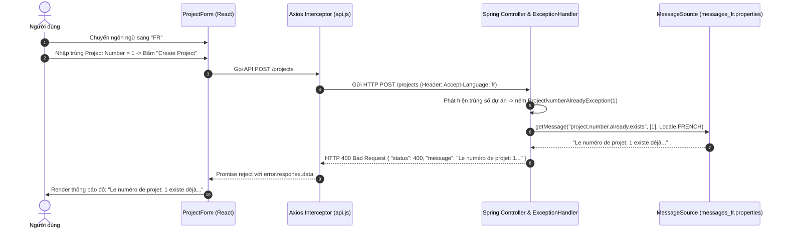

# Cẩm Nang Toàn Diện Về Xử Lý Đa Ngôn Ngữ (i18n) Trong PIM Tool (React & Spring Boot)

Tài liệu này tổng hợp toàn bộ kiến trúc, cơ chế hoạt động tầng dưới (Under the Hood), cách thức triển khai chi tiết và quy chuẩn mở rộng cho hệ thống **Đa ngôn ngữ (Internationalization - i18n)** xuyên suốt từ **Frontend (React)** đến **Backend (Spring Boot)** của dự án PIM Tool.

---

## 📑 MỤC LỤC
1. [Tổng quan Kiến trúc Đa ngôn ngữ Toàn diện (End-to-End Architecture)](#1-tổng-quan-kiến-trúc-đa-ngôn-ngữ-toàn-diện)
2. [Triển khai phía Frontend (React + Counterpart)](#2-triển-khai-phía-frontend-react--counterpart)
   - [Lưu trữ Locale State (Zustand + LocalStorage)](#21-quản-lý-và-lưu-vết-trạng-thái-ngôn-ngữ)
   - [Dịch UI tĩnh với `<Translate />`](#22-dịch-giao-diện-tĩnh-với-react-translate-component)
   - [Tự động gửi Header `Accept-Language` qua Axios Interceptor](#23-tự-động-gắn-header-accept-language-qua-axios)
   - [Kỹ thuật Chống Nhảy Giao diện (Anti-Layout Shift)](#24-kỹ-thuật-chống-nhảy-giao-diện-khi-đổi-ngôn-ngữ)
3. [Triển khai phía Backend (Spring Boot + MessageSource)](#3-triển-khai-phía-backend-spring-boot--messagesource)
   - [Bản chất ResourceBundle & Thuật toán Fallback](#31-bản-chất-resourcebundle--thuật-toán-fallback)
   - [Cấu hình UTF-8 & Resource Bundle](#32-cấu-hình-utf-8-và-từ-điển-properties)
   - [Tự động phân giải `Locale` qua `AcceptHeaderLocaleResolver`](#33-cơ-chế-tự-động-phân-giải-locale)
   - [Nội suy tham số động trong `GlobalExceptionHandler`](#34-nội-suy-tham-số-động-trong-globalexceptionhandler)
4. [Luồng xử lý lỗi từ Backend lên Frontend (Sequence Diagram)](#4-luồng-xử-lý-lỗi-từ-backend-lên-frontend)
5. [Hướng dẫn Mở rộng Thêm Ngôn ngữ Mới (Extensibility Guide)](#5-hướng-dẫn-mở-rộng-thêm-ngôn-ngữ-mới)
6. [Bảng tổng hợp Checklist & Best Practices](#6-bảng-tổng-hợp-checklist--best-practices)

---

## 1. Tổng quan Kiến trúc Đa ngôn ngữ Toàn diện

Hệ thống PIM Tool phân chia trách nhiệm i18n theo nguyên lý kiến trúc chuẩn quốc tế:

```
┌────────────────────────────────────────────────────────────────────────┐
│                        FRONTEND (React Client)                         │
│  - Chịu trách nhiệm dịch 100% Giao diện tĩnh (Menu, Labels, Buttons).  │
│  - Validate cú pháp client-side (Required, Format, Date range).        │
│  - Lưu giữ Locale người dùng chọn ('en' | 'fr') vào LocalStorage.       │
│  - Tự động đính kèm header HTTP: [Accept-Language: <locale>]            │
└───────────────────────────────────┬────────────────────────────────────┘
                                    │ HTTP Request (Accept-Language: fr)
                                    ▼
┌────────────────────────────────────────────────────────────────────────┐
│                        BACKEND (Spring Boot)                           │
│  - AcceptHeaderLocaleResolver đọc header -> Tạo đối tượng Locale.      │
│  - Xử lý nghiệp vụ & Bắt Exception (Trùng ID, Sai Visa, 409 Lock...). │
│  - MessageSource tra cứu messages_*.properties & nội suy tham số.     │
│  - Trả về JSON chứa 'message' hoàn chỉnh bằng đúng ngôn ngữ yêu cầu.  │
└────────────────────────────────────────────────────────────────────────┘
```

---

## 2. Triển khai phía Frontend (React + Counterpart)

### 2.1. Quản lý và Lưu vết trạng thái ngôn ngữ
Trạng thái ngôn ngữ được quản lý tập trung bằng **Zustand** và đồng bộ với **LocalStorage** (`src/store/useProjectStore.js`):
* Khi mở app: Tự động nạp ngôn ngữ đã lưu (`localStorage.getItem('pim_locale') || 'en'`).
* Khi người dùng bấm chuyển **EN ↔ FR**:
  1. Cập nhật state trong Zustand.
  2. Ghi đè vào `localStorage`.
  3. Gọi `counterpart.setLocale(newLocale)` để re-render lại toàn bộ UI.

### 2.2. Dịch giao diện tĩnh với `react-translate-component`
Tất cả các nhãn, tiêu đề, nút bấm đều dùng `<Translate content="..." />` thay vì hardcode text:
```jsx
// Ví dụ trên Header
<Translate content="header.name" />

// Ví dụ trên Form
<Translate content="projectForm.fieldNumber" />
```
Từ điển được định nghĩa trong `src/Material/lang/en.js` và `src/Material/lang/fr.js`.

### 2.3. Tự động gắn Header `Accept-Language` qua Axios
Trong `src/services/api.js`, Axios Request Interceptor đảm bảo **100% các request gọi lên server** đều mang theo ngôn ngữ hiện tại:

```javascript
import axios from "axios";
import counterpart from "counterpart";

const api = getAxiosInstance();

if (api.interceptors) {
    // Tự động đính kèm ngôn ngữ của người dùng vào mỗi HTTP request
    api.interceptors.request.use(
        (config) => {
            config.headers = config.headers || {};
            config.headers["Accept-Language"] = counterpart.getLocale();
            return config;
        },
        (error) => Promise.reject(error)
    );
}
```

### 2.4. Kỹ thuật Chống Nhảy Giao diện khi đổi ngôn ngữ
Khi chuyển đổi giữa tiếng Anh và tiếng Pháp, độ dài chữ thay đổi đáng kể (ví dụ: *"Log out"* 7 ký tự $\leftrightarrow$ *"Déconnexion"* 11 ký tự; *"Search Project"* $\leftrightarrow$ *"Rechercher"*). Nếu để `width: auto`, các box sẽ co giãn làm xô lệch toàn bộ giao diện xung quanh.

**Giải pháp đã áp dụng:**
1. **Khóa kích thước cố định (Fixed Dimensions):**
   * Header Links: `.helpLink` (`60px`, text-align: center), `.logoutLink` (`115px`, text-align: right), `.langSwitch` (`60px`).
   * Nhãn khoảng ngày: `.dateSeparatorLabel` cố định `width: 90px; text-align: right`.
2. **Khóa chống xuống dòng & Mở rộng nút bấm:**
   * Thêm `white-space: nowrap !important;` vào toàn bộ hệ sinh thái nút bấm (`.btn-pim-primary`, `.btn-pim-secondary`).
   * Nút Submit/Create: `width: 175px;` (chứa thoải mái cả *"Create Project"* lẫn *"Créer le projet"* trên 1 dòng).
   * Nút Cancel: `width: 140px;`
   * Nút Search: `min-width: 175px;`
   * Cột Delete trong bảng: Đặt `width: 95px;` để từ *"Supprimer"* không làm tràn bảng.

---

## 3. Triển khai phía Backend (Spring Boot + MessageSource)

### 3.1. Bản chất ResourceBundle & Thuật toán Fallback
Spring Boot sử dụng `ResourceBundleMessageSource` để quản lý các file `.properties`. Khi có một request yêu cầu tra cứu key với locale `fr`:

```
1. Tìm trong messages_fr.properties (Bản dịch tiếng Pháp)
       ↓ (Nếu không thấy file hoặc key)
2. Tìm trong messages_en.properties (Bản dịch ngôn ngữ mặc định)
       ↓ (Nếu không thấy)
3. Tìm trong messages.properties (File gốc fallback cuối cùng)
       ↓ (Nếu vẫn không thấy)
4. Trả về Default Message được truyền trong code Java (Tránh crash ứng dụng)
```

### 3.2. Cấu hình UTF-8 và Từ điển Properties
Trong `src/main/resources/application.properties`:
```properties
spring.messages.basename=messages
spring.messages.encoding=UTF-8
```
> [!IMPORTANT]
> Thuộc tính `spring.messages.encoding=UTF-8` là **bắt buộc**. Mặc định Java ResourceBundle đọc file theo chuẩn `ISO-8859-1`, nếu không có cấu hình này, các ký tự tiếng Pháp có dấu như `é`, `à`, `è`, `ô` sẽ bị vỡ font thành dấu `?`.

Các file từ điển tương ứng:
* **`messages.properties` (Mặc định / Tiếng Anh):**
  ```properties
  project.number.already.exists=The project number: {0} already existed. Please select a different project number
  employee.visa.not.found=The following visas do not exist: {0}
  project.status.invalid.delete=Only projects with status "New" can be deleted.
  project.concurrent.conflict=The project was updated or deleted by another transaction. Please refresh the page and try again.
  project.not.found=Project not found with id: {0}
  ```
* **`messages_fr.properties` (Tiếng Pháp):**
  ```properties
  project.number.already.exists=Le numéro de projet: {0} existe déjà. Veuillez sélectionner un autre numéro
  employee.visa.not.found=Les visas suivants n''existent pas : {0}
  project.status.invalid.delete=Seuls les projets ayant le statut "Nouveau" peuvent être supprimés.
  project.concurrent.conflict=Le projet a été modifié par un autre utilisateur. Veuillez actualiser et réessayer.
  project.not.found=Projet introuvable avec l''identifiant: {0}
  ```
  *(Lưu ý cú pháp: Dấu nháy đơn `'` trong Java MessageFormat phải được viết escape thành `''`)*.

### 3.3. Cơ chế tự động phân giải Locale
Spring MVC cung cấp sẵn `AcceptHeaderLocaleResolver`. Mỗi khi có request, Spring tự động bóc tách header `Accept-Language` và inject đối tượng `java.util.Locale` vào bất kỳ handler method nào có khai báo tham số `Locale locale`.

### 3.4. Nội suy tham số động trong `GlobalExceptionHandler`
Để đưa các biến động (ví dụ: số dự án `{0}` hoặc danh sách visa `{0}`) vào câu thông báo, Exception class lưu trữ dữ liệu đó và truyền qua `new Object[]{...}`:

```java
@RestControllerAdvice
public class GlobalExceptionHandler {
    private final MessageSource messageSource;

    public GlobalExceptionHandler(MessageSource messageSource) {
        this.messageSource = messageSource;
    }

    @ExceptionHandler(ProjectNumberAlreadyException.class)
    public ResponseEntity<ErrorResponseDto> handleProjectNumberAlready(
            ProjectNumberAlreadyException ex, Locale locale) {
        
        // Tra cứu message theo locale và nội suy tham số projectNumber vào {0}
        String message = messageSource.getMessage(
                "project.number.already.exists",
                new Object[]{ex.getProjectNumber()},
                ex.getMessage(),
                locale
        );

        ErrorResponseDto error = new ErrorResponseDto(
                HttpStatus.BAD_REQUEST.value(),
                "PROJECT_NUMBER_ALREADY_EXISTED",
                message
        );
        return new ResponseEntity<>(error, HttpStatus.BAD_REQUEST);
    }
}
```

---

## 4. Luồng xử lý lỗi từ Backend lên Frontend



---

## 5. Hướng dẫn Mở rộng Thêm Ngôn ngữ Mới

Khi muốn bổ sung một ngôn ngữ mới (ví dụ: **Tiếng Việt - `vi`** hoặc **Tiếng Đức - `de`**):

### Bước 1: Phía Frontend
1. Tạo file từ điển mới: `src/Material/lang/vi.js`.
2. Đăng ký từ điển trong `src/store/useProjectStore.js` hoặc component gốc:
   ```javascript
   import vi from "../Material/lang/vi";
   counterpart.registerTranslations("vi", vi);
   ```
3. Bổ sung nút chuyển ngôn ngữ trên Header:
   ```jsx
   <span onClick={() => handleLanguageChange("vi")}>VI</span>
   ```

### Bước 2: Phía Backend
1. Tạo file mới: `src/main/resources/messages_vi.properties`:
   ```properties
   project.number.already.exists=Mã số dự án: {0} đã tồn tại. Vui lòng chọn số khác
   employee.visa.not.found=Các visa sau đây không tồn tại: {0}
   project.status.invalid.delete=Chỉ có dự án ở trạng thái "New" mới được phép xóa.
   project.concurrent.conflict=Dự án đã được chỉnh sửa bởi người dùng khác. Vui lòng tải lại trang.
   project.not.found=Không tìm thấy dự án với mã: {0}
   ```
2. **Không cần sửa bất kỳ dòng code Java nào!** Spring Boot tự động nhận diện `Accept-Language: vi` và đọc file `messages_vi.properties`.

---

## 6. Bảng tổng hợp Checklist & Best Practices

| Tiêu chí | Giải pháp triển khai trong PIM Tool |
| :--- | :--- |
| **Không hardcode text** | 100% chuỗi tĩnh nằm trong file `.js` (Frontend) và `.properties` (Backend). |
| **Quản lý Encoding** | UTF-8 xuyên suốt cả React và Spring Boot (`spring.messages.encoding=UTF-8`). |
| **Fail-safe UI** | Nếu Backend ném lỗi chưa có bản dịch, cơ chế Fallback tự động lấy câu mặc định. |
| **Chống vỡ Layout (CLS)** | Cố định `min-width` / `width` cho các nút bấm và nhãn; sử dụng `white-space: nowrap`. |
| **Bảo lưu ngôn ngữ** | Lưu trạng thái vào `localStorage` để khi F5 không bị mất lựa chọn ngôn ngữ. |
